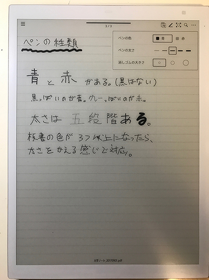
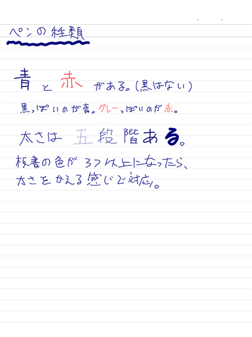
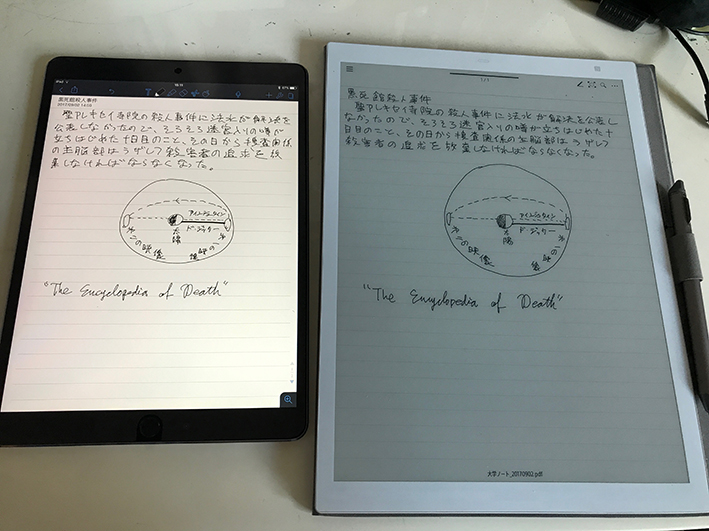
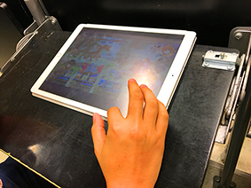

# 更新履歴
* 2017/09/02 16:48:00 JST 公開
* 2017/09/02 18:00:00 JST [ノートテンプレート](#templates)について追記。

# 要旨 #

科研費[^1]が使えるようになり、調子にのって SONY の電子ペーパーと iPad Pro とを買ったら予算がなくなった[^2]ので、自慢をする。

<iframe style="width:120px;height:240px;" marginwidth="0" marginheight="0" scrolling="no" frameborder="0" src="//rcm-fe.amazon-adsystem.com/e/cm?lt1=_blank&bc1=000000&IS2=1&bg1=FFFFFF&fc1=000000&lc1=0000FF&t=konn06-22&o=9&p=8&l=as4&m=amazon&f=ifr&ref=as_ss_li_til&asins=B072MXJZ6X&linkId=ff2cc56b82ece996923c7d8018106494"></iframe>
<iframe style="width:120px;height:240px;" marginwidth="0" marginheight="0" scrolling="no" frameborder="0" src="//rcm-fe.amazon-adsystem.com/e/cm?lt1=_blank&bc1=000000&IS2=1&bg1=FFFFFF&fc1=000000&lc1=0000FF&t=konn06-22&o=9&p=8&l=as4&m=amazon&f=ifr&ref=as_ss_li_til&asins=B073PWHKNT&linkId=4e1cef06fe347466b2022261809d2a0a"></iframe>

あ、長いので結論だけ読みたければ[結論](#conclusion)の節にどうぞ。

何故買った[^4]
--------------
勿論自慢するためで、こちらが自慢です。

ところで机の上が汚ないのは自慢にならない。

……というのは仮定と結論が逆で、大学院生、少なくとも数学の院生というのは莫大な量の紙を消費することが知られている。
日頃の研究生活での計算[^3]にも使うし、セミナーやサマースクールがあれば、ノートを取るのに都度消費される。
パソコンにリアルタイムに頑張って打ち込んでいく猛者もいるけれど、タイピングの速度だけでなく数式を瞬時に入力していくというのは、単に紙に書き込むよりも余計に脳が疲れる。
一般に、数式や図を綺麗に出力する標準的な方法としてLaTeXというのがあるのだが、黒板にパッと描かれた数式に対応するコマンドを入力したりするのは瞬発力が必要だし、数学者というのは黒板に描いた数式を突然丸で囲んだり、一部消して違うことを書きはじめたりする。
更にフリーハンドで概念のお気持を表す絵などもしばしば書くので、これを計算機でリアルタイムにノートに落とし込んでいくのはかなりしんどい。

そう、数学者というのはとかく数式を書いていると思われがちだが、それと同じくらい絵を良く描く。
絵といってもなんかこうやたら大きな目がついていたり肌色が多かったりする訳でもなく、数学的概念を良くわかりたいので、良くわかるためにひたすら抽象的な絵を描く。
なんか高校でやったベン図とかカルノー図みたいなのを描いていると思ってもらえればいい。
たとえば以下はうちの分野の人間が宇宙をどう見ているかという図です：

これを宇宙だと思うのは集合論という分野の人間だけなので、他の人に見せて正気を疑われても責任は取りません。

とにかく、数式や絵を写し取っていくのにはデジタルな方法では限度があり、紙が必要という話で、これはもうベラボウに使う。
たとえば、6月中頃から3週間ほどシンガポールでサマースクールがあったのだが、この頃はまだiPadも電子ペーパーもなかったので、大量のルーズリーフを持っていった。
結果として、50枚くらいあったルーズリーフを全て使い切った上、現地で調達したA4大の計算用紙も20枚くらい消費した。

紙というのは1枚程度であればどうという事もないのだが、沢山重なるととにかく嵩張るという難点がある。
実際、シンガポール帰りの荷物も調達したり書いたりの厚みでかなり大変なことになった。

また、出張先でも研究はするし、長期休暇で実家に戻っても机に向かわなければならない。
そうなった時に、研究資料もある程度一緒に運ばなくてはならない。
研究資料というのは論文であったり、教科書であったりもする。
各分野に基礎知識を集成したような書籍というものがあり、そういったものはハンドブックと呼ばれている。
ハンドブックと呼ばれているのだが、たとえば私の分野の "Handbook of Set Theory" はハードカバーで全3巻、総勢2100ページに及び、いったい何処がハンドなのかというのは大変理解に苦しむところである[^5]。
読む凶器として名高い京極夏彦『鉄鼠の檻』だって文庫で1300ページ程度である。

<iframe style="width:120px;height:240px;" marginwidth="0" marginheight="0" scrolling="no" frameborder="0" src="//rcm-fe.amazon-adsystem.com/e/cm?lt1=_blank&bc1=000000&IS2=1&bg1=FFFFFF&fc1=000000&lc1=0000FF&t=konn06-22&o=9&p=8&l=as4&m=amazon&f=ifr&ref=as_ss_li_til&asins=4062732475&linkId=87927d91c00562449ddbec79ec7f5194"></iframe>
<iframe style="width:120px;height:240px;" marginwidth="0" marginheight="0" scrolling="no" frameborder="0" src="//rcm-fe.amazon-adsystem.com/e/cm?lt1=_blank&bc1=000000&IS2=1&bg1=FFFFFF&fc1=000000&lc1=0000FF&t=konn06-22&o=9&p=8&l=as4&m=amazon&f=ifr&ref=as_ss_li_til&asins=1402048432&linkId=92f58eb47763040a2ab8477d76bca895"></iframe>
勿論、こんなものを持ち歩く訳にもいかない。
有り難いことに、2010年代も終盤に差し掛かり電子化の進んだ昨今にあっては、PDFやらEPUBやらがある。
あるのだが、いちいち資料を読むためだけにMacBook Proを取り出していては牛刀だし、といってiPhoneの画面は数学書を読むのには狭すぎる。
そうすると結局本当にすぐ読みたいものは印刷して、嵩張らなさそうだったらテキストを荷物に入れて……とするので余計に嵩張ることになる。

### まとめ
* セミナーや計算に使う紙が嵩張る
* 論文や研究資料を物理的に運搬すると死ぬ

# そこで電子ペーパーとiPad Pro
そこで電子ペーパーとiPad Proの登場と相成ったというワケ。

特に何も考えずに購入申請を出したら、数日前くらいにSONYの電子ペーパーの新モデルDPT-RP1が出て、その翌日に新しいiPad Proが出るというような時期だったので、タイミング良くどちらも新しいものが買えた。
その分予約とかが殺到していて、注文から届くまでに2、3週間掛かってしまって、その間にシンガポール出張が挟まってしまったのが悲しい。

それから二ヶ月、セミナーやらスウェーデン出張やら帰省やらで両者使ってみた感想を以下つらつらと述べる。

## SONYの電子ペーパー端末DPT-RP1
これは内輪の研究集会やセミナーで先生が使っているのを見て、前々からこれは良さそうだぞ〜と思っていたものであった。

SONYが「[デジタル時代の「紙」をつく](https://www.sony.co.jp/SonyInfo/design/works/products/DPT-RP1/)」った結果とのこと。
オープンプライスなのでAmazonだと10万円くらいするけど、[SONYの公式ストア](http://www.sony.jp/digital-paper/products/DPT-RP1/)だと8万円ちょいで買え（2017年9月現在）、特に手続きなく満了後も私物化できる範囲内に収まる。
私は専用ケースカバーも買って、これも1万円くらいする。正直予算がなかったら買わないと思う。

適当なデモ：

<iframe class="embed-responsive-item" width="112" height="63" src="https://www.youtube.com/embed/OiDvqwj-9TI" frameborder="0" allowfullscreen></iframe>

### ノート機能
最初に使ってみて思ったのは、電子インクなので目に優しい、ということと、思いの外ペンの反応が良くて快適、ということだった。
最初はペンの充電が足りず反応が悪かったので、ちょっと筆圧を掛けなくてはいけなかったが、充電すれば非常に快適になった。

私は非常に悪筆で筆圧が強く、どのくらい強いのかというと黒板に筆跡が残るくらい強い。
そこへ行くと、DPT-RP1のスタイラスは**ほとんど筆圧を掛けずに書くことが出来**、手への**負担が大幅に軽減**されるので大変助かった。
紙に長時間書きつづけるよりも快適ですらある。

とはいえ、上の動画でもわかる通り、時々動作がモタついたり、ページ送りが待機時間がかかったりする時もある。
今のところ、セミナーを聴いていてノートを取れないレベルでディレイが発生した事はないので許容範囲ではあるけど、ちょっとイラつく。

選択範囲内の書き込みを動かしたり、カット＆ペースト出来るのも大変便利。
数学者はよく、二つの類似の定理や定義を板書するのに、最初に書いたやつの一部を消して書き換える、というようなことをやって、ノートを取る側は焦ることになるのだが、カット＆ペーストを使えば容易に複製出来るので大変やりやすいし、何回かそういう局面があった。

ノート機能について不平を言うのなら、先程の時々モタつく所以外に、**アンドゥ・リドゥ**（取り消し・やり直し）がないことが大きい。
たとえば、消しゴム機能は1ストロークごとに一気に消してしまうので、消したくない所を消しちゃったとかした時に、取り消し機能がないともっかい書き直す羽目になる。
今のところ注意しているのでそんな事態にはなっていないが、ちょっと不便だ。

### 君だけのペン先を見付けよう
また、**ペン先は消耗する**ので、定期的に交換が必要になる。
ペン先には二種類あり、鉛筆っぽい書き味のものと、ボールペンっぽい書き味のものがある。
先っぽが**摩耗してくると画面の反応は格段に悪くなる**が、デフォルトで4つはいっているし、そんなに値段はしないので、気に入ったタイプの物をまとめ買いしておけば問題はない。
因みにぼくは鉛筆っぽいタイプの方（フェルト）を愛用している。

また、ボールペンっぽいタイプのペン先の方が**画面に筆跡が残りやすい**。
といっても、これはペン先の削れた黒い色が付着しているだけなので、**ウェットティッシュやハンカチで拭けば綺麗に落ちる**。
この辺り、画面のメンテナンスについての指針が公式ヘルプで見付けられなかったので、水気のあるもので拭いて平気なのかはちょっと不安だが、今のところ何とかなる。

ノートに書き込み出来るペンは、色が赤と青の二色あり、太さは5種類ある。
画面上では青が黒、赤がグレーがかって表示される。
以下、一つ目が画面上の表示と、二つ目が実際に生成されるノートである。

ノートのデータはPDFとして保存されている。
macOSのQuickLook（Finderでスペースバー押すとプレビューされるアレ）で見るとなんかすごく書き込みが滅茶苦茶にズレて見えるのだが、Preview.appやAdobe Readerで開けばちゃんと読める。これは多分QuickLookが悪いのではないかと思う。

### 同期はUSBの信頼性に若干疑問
書いたノートをPCに転送したり階層構造で管理したりするには、専用のアプリを使う。
個別に転送する以外にも、特定のディレクトリをPCの別のディレクトリと同期させたりすることができる。
接続方法はUSBケーブル、Wi-Fi、Bluetoothの三種類の経路が用意されていて、当然だがUSBが一番速い。
Wi-Fiの設定はUSBケーブルで接続しないと出来ないのだが、なんか二ヶ月使っているうちにUSB経由での同期がたまにしか成功しなくなってしまったので、実家のWiFiを登録出来ていない。悲しい……。
付属の黒いUSBケーブル以外での動作は保証しないとあるのだが、我が家には黒いUSBケーブルが沢山あり、いずれも駄目だったり上手くいったりしていて、よくわからない。
サポートに連絡してみるべきだろうか。

まあBluetoothで接続すれば、遅いなりに同期は出来るので問題はないが。

### ノートのテンプレートも豊富（追記） {#templates}
普段数学をやる上では大学ノートのフォーマットしか使わないが、DPT-RP1には他にも幾つかノートのテンプレートが用意されている。
更に、同期アプリを使えば**自作のテンプレートを追加**出来る。

たとえば、あんまり研究で使い所はなさそうだが、興が乗って原稿用紙を創ってみたのが以下の動画だ：

<iframe class="embed-responsive-item" width="112" height="63" src="https://www.youtube.com/embed/ePdUGbB6A-o" frameborder="0" allowfullscreen></iframe>

1ページ分だけのPDFを、画面の寸法に合わせて作ればそれがテンプレートになる。
横長なら横置き用のテンプレ、そうでなければ縦置き用として判断されるようだ。
上の例では、PDFのページ送り属性を通常の「左→右」ではなく「右→左」に設定することで、縦書きに合致した方向に指をスワイプすれば次ページ・挿入が自動で出来るようになっている。
この辺りの説明は特に説明書にはなかったが、流石はSONYだけあって、この辺りの縦書きに対する気配りも細やかで好印象である。

### PDFリーダとして──赤入れに最適
DPT-RP1にはPDFリーダー機能もついている。
SONYの電子ペーパーといえば、電子書籍端末の「Reader」が先に出て有名だったが、PDFビューワとしては正直ページ送りが遅くてお話にならないレベルだった。
一方DPT-RP1はどうか……というと、そもそもノートのデータ自体がPDFで保存されていることもあり、前述の通りページ送りはたまに待たされるが平均的には軽快といって良い。
ただ、**ナヴィゲーション機能は貧弱**である。
たとえば、ページの移動は指で1ページずつスワイプするか、スライダーを出しておおまかな位置を選ぶことしかできず、**直接ページ番号を入れて飛ぶことはできない**。
また、戻る・進むといった**履歴管理**もない。
ただ、書き込みをした箇所の一覧は表示出来るし、**星型やアスタリスク型の書き込みだけを抽出できる**ので、「**ページを切り替えるまえに隅っこに落書きしとく**」というなんともアドホックな方法で人力履歴管理が出来なくもない。
また、PDFを文字列検索することも出来るが、これはちょっとかなり遅い。
この辺り、「デジタル時代の紙」としては名折れといって良いのではないだろうか。

一方で、**開いているPDFに対してサイドノートが作れる**のは良い点だと思う。

また、PCに接続されている時に「**電子ペーパーに印刷**」という機能が使えて、これは普通の印刷ダイアログから任意の書類を「印刷」出来る、というシロモノである。
たとえば、Wordの縦書きの書類を電子ペーパーに「印刷」したり、論文を「印刷」したり、書類を「印刷」したりすることが出来る。
これは単に「印刷データのPDF化→転送」という操作をワンストロークで出来るだけといえばそうなのだが、任意のアプリケーションから使えるので大変便利だ[^6]。
PDFに手書きで書き込むこともできるので、論文や書類に赤入れが出来てとても重宝する。
電子ペーパーは紙に近い見た目なので、PCの画面上で見るよりも印刷したものに赤入れをするような気分で出来、これはとてもよいものだと思う。

### 動作時間と充電
充電は、Wi-Fi機能やBluetooth機能をつけっぱなしにしているとすぐ切れてしまう。
しかし、こいつらは同期のときだけあれば良いので、ノートとして使う時は切っておいて問題がない。
事例として、フル充電した状態で9時から18時までのサマースクールで使っていたところ、16:30頃に「本体充電が残り僅かだよ」と言う警告が出て来た。
裏を返せば**平均して連続7時間稼動**という事で、まあそう悪くはない。
研究の計算用紙にも使っていると7時間とかアッと言う間だが、**充電中も書き込みは出来る**ので、定期的に電池残量を確認して都度充電していても、そこまでハンデにならない。

ペンの方はもう少し充電が長持ちするが、**ペンの充電残量を確認する方法がない**のは少し使いづらい。
延々と使っていると**急に「ペンがもうすぐ死ぬから充電して」というアラートが出て暫くすると死ぬ**、という按配である。
一応ペンも充電しながら使えはするのだが、それは流石に動きが制限されて使いづらかった。
怖いのでペンはこまめに充電しているが、やっぱり本体の方でペンの充電も確認出来るべきだと思う。

### 総評：ノートとしては十分実用に耐え、PDFリーダは赤入れと講演レジュメ参照用に
ページナビゲーションや取り消し機能がなかったり、時々動作がモタついたりはするものの、**ノート取りには十分使える**というのが二ヶ月使った感想である。
欲をかくとペンの色がもうすこし欲しくはあるけど、太さを変えればまあ区別は付くだろう。

PDFリーダとしては、数十ページ以上あるような**ブ厚い資料を行きつ戻りつ読むのには向かない**。
一方で、**短めの資料を順繰りに読んだり赤入れに使う**のには十分な機能があると言える。
最近は、セミナーでは電子ペーパーに「印刷」したレジュメを片手に発表しつつ、指摘や気付いた点はその都度欄外やサイドノートに記録する、という手を採り、頗る快調である。
とはいえ、数時間持ってると流石に疲れるけど。

以上を踏まえて、**細かい不満点はあれど適する応用分野あり**といった結論か。
不満部分についても主に**ソフトウェアの機能が足りない**、という感じなので、**今後のアップデートに期待**していきたい。

## iPad Pro 10.5" (2017) (+ Apple Pencil, Smart Keyboard)
こちらも発売されたばかりの iPad Pro 10.5インチ。

こちらも机の上が汚なかったので中途半端にレタッチしたけど諦めた。
買った動機はどちらかというと「資料読みようのタブレットが欲しい」というもの。
うちは先カンブリア紀から続くApple信者の家系なので、タブレットを買うならiPad Proというのは既定事項で、あとは私物化できる価格帯に収まるモデルを選ぶだけ。
という訳で、今回購入したのは iPad Pro 10.5" (2017) Wi-Fi モデル。
最初はSIMスロット付きのを買って自前で格安SIMでも契約しようかと思っていたのだけど、そうすると微妙に10万円を越えてしまうし、SIMの説明が面倒になるのでWiFiモデルにした。

### 周辺機器・アクセサリ ###
以前自主ゼミで某氏がApple Pencilを使ってノートを取っているのを「1万円の鉛筆で数学のノートを取ってやるやつがいるぞ」とひどい嘲笑をしたのだが、ついでなので1万円の鉛筆も買った。

<iframe style="width:120px;height:240px;" marginwidth="0" marginheight="0" scrolling="no" frameborder="0" src="//rcm-fe.amazon-adsystem.com/e/cm?lt1=_blank&bc1=000000&IS2=1&bg1=FFFFFF&fc1=000000&lc1=0000FF&t=konn06-22&o=9&p=8&l=as4&m=amazon&f=ifr&ref=as_ss_li_til&asins=B018MX3PNU&linkId=5f6ae5e16fe2de814f5dfc8bfc9d07ed"></iframe>

ところで、Apple Pencilが出るときに早合点して「ジョブズは iPhone 出すときに "Who wants stylus?" つってたじゃんダブスタｗｗｗ」と嘲笑していた人々がいたが、そもそもApple Pencilは単なるスタイラスではなくて（単なるスタイラスに1万円払うのはそれこそ馬鹿だ）、プロのデザイナやイラストレータが絵を描くための高精度で繊細なポインティング・デバイスである。
某氏を「数学のノートに使うの？」と嘲笑したのはそういう文脈があったのだが、私も買ってしまったので同罪である。
まあ、電子ペーパーを注文した時点で10万円の紙とペンでノートを取ることになっていたので、こんなの余罪みたいなものだ。

Apple Pencil は iPad Pro の Lightning 口に接続して急速充電するのだが、それ以外にも普通の Lightning⇔USB ケーブルに接続して充電するための小さな変換器もある。
また、充電中はペン上部のカバーは外さないといけない。
こいつらを失くしそうで不安だったので、合わせてそいつらを本体やUSBケーブルに繋ぎ止めとくやつも買った。

<iframe style="width:120px;height:240px;" marginwidth="0" marginheight="0" scrolling="no" frameborder="0" src="//rcm-fe.amazon-adsystem.com/e/cm?lt1=_blank&bc1=000000&IS2=1&bg1=FFFFFF&fc1=000000&lc1=0000FF&t=konn06-22&o=9&p=8&l=as4&m=amazon&f=ifr&ref=as_ss_li_til&asins=B01J7NG1Z8&linkId=83874cd1e9c63209d59c05b7181da8ec"></iframe>

ソフトウェアキーボードはどうも信用ならないので、Apple純正の iPad Pro 向け Bluetooth キーボード・Smart Keyboard も同時に購入した：

<iframe style="width:120px;height:240px;" marginwidth="0" marginheight="0" scrolling="no" frameborder="0" src="//rcm-fe.amazon-adsystem.com/e/cm?lt1=_blank&bc1=000000&IS2=1&bg1=FFFFFF&fc1=000000&lc1=0000FF&t=konn06-22&o=9&p=8&l=as4&m=amazon&f=ifr&ref=as_ss_li_til&asins=B072MKYRHR&linkId=5ff740eda9696c89f718b58b44cbd024"></iframe>
<iframe style="width:120px;height:240px;" marginwidth="0" marginheight="0" scrolling="no" frameborder="0" src="//rcm-fe.amazon-adsystem.com/e/cm?lt1=_blank&bc1=000000&IS2=1&bg1=FFFFFF&fc1=000000&lc1=0000FF&t=konn06-22&o=9&p=8&l=as4&m=amazon&f=ifr&ref=as_ss_li_til&asins=B072MF9642&linkId=2374b4556c486d2e76ed085e27de62ce"></iframe>

このカバー一体型キーボードには Apple Pencil を収納する部分がついていないので、別途収納用のストラップ（？）も買った。
これで一通り周辺機器は揃った感じだ。

### PDFリーダとしての iPad Pro
タブレットを欲した最初の動機は、PDFリーダであった。
色々情報を勘案したけっか、現在は**GoodReader**というアプリを使っている。

<a href='https://itunes.apple.com/jp/app/goodreader-for-good/id549411194?mt=8&uo=4&at=11l73q' rel='nofollow' target='_blank'>GoodReader for Good</a>

Good.iWare, Inc. 

posted with <a href='http://ituneslinker.biz/' title='iTunes/iPhoneアプリランキングリンク作成ツール' target='_blank'>iTunesLinker</a> at 17.09.02

PDFへの書き込みや履歴、付箋など欲しい機能は一通り揃っているし、読みやすい。
ただ、履歴は「戻る」だけなのが若干物足りず、タブが macOS のデフォルトと異なって選択されているタブがへっこんで見えるようになっているのが最初マゴつく。
また、**日本語対応は壊滅的**である。
日本語のファイルも開いて読めるが、検索窓に日本語を入力しようとすると文字化けする。日本語名のファイルが開けないというレビューもある。
まあ、基本的に読むのは英語の資料なので今のところそこまで困っていない。

気に喰わなくなったら違うアプリを入れれば良いので、**長文PDFリーダとしては圧倒的に iPad Proが最適**である。

### 他の電書リーダー
iPad Proはタブレット端末なので、勿論ネットサーフィンも出来るし、**PDF以外の電子書籍も読める**。
純正のEPUBリーダーである iBooks[^7] が付属しているし、青空文庫収録の本なら「**Neo文庫**」が使える。
勿論**Kindle**アプリを入れればKindleの本も読める。

<a href='https://itunes.apple.com/jp/app/neo%E6%96%87%E5%BA%AB/id525695233?mt=8&uo=4&at=11l73q' rel='nofollow' target='_blank'>neo文庫</a>

Kaigi-An, Inc. 

posted with <a href='http://ituneslinker.biz/' title='iTunes/iPhoneアプリランキングリンク作成ツール' target='_blank'>iTunesLinker</a> at 17.09.02

<a href='https://itunes.apple.com/jp/app/kindle/id302584613?mt=8&uo=4&at=11l73q' rel='nofollow' target='_blank'>Kindle</a>

AMZN Mobile LLC 

posted with <a href='http://ituneslinker.biz/' title='iTunes/iPhoneアプリランキングリンク作成ツール' target='_blank'>iTunesLinker</a> at 17.09.02

スウェーデン出張の際、『世界の歩き方』をKindleに入れておいた所、とても重宝した。

### ノート機能──悪筆家としては電子ペーパーに軍配
色々試してみた結果、今は Notability に落ち着いている。

<a href='https://itunes.apple.com/jp/app/notability/id360593530?mt=8&uo=4&at=11l73q' rel='nofollow' target='_blank'>Notability</a>

Ginger Labs 

posted with <a href='http://ituneslinker.biz/' title='iTunes/iPhoneアプリランキングリンク作成ツール' target='_blank'>iTunesLinker</a> at 17.09.02

上で電子ペーパーの機能として挙げたような特徴は一通り備えている。
その上、**アンドゥ機能がついている**。ただ、見た感じリドゥはない？
Apple Pencilの筆圧検知機能にも対応していて、筆圧によって太さが変わってくれたりする。まあ、数学のノートを取るのには使わないか。

ただ、問題は**iPadの画面は良くすべる**という事だ。
先述のように私は筆圧が強い。すると、何もない状態の iPad の画面では、**ただただペン先がすべってしまってマトモに文字が書けない**。
色々調べて、**エレコムのペーパーライク保護フィルム**を買って貼った結果、許容範囲の書き心地まで落ち着いた。

<iframe style="width:120px;height:240px;" marginwidth="0" marginheight="0" scrolling="no" frameborder="0" src="//rcm-fe.amazon-adsystem.com/e/cm?lt1=_blank&bc1=000000&IS2=1&bg1=FFFFFF&fc1=000000&lc1=0000FF&t=konn06-22&o=9&p=8&l=as4&m=amazon&f=ifr&ref=as_ss_li_til&asins=B06XH5M4B4&linkId=33a37106e129183a7e1c53295626e18a"></iframe>

しかし、それでも堅い画面に文字を書こうとするとどうしても筆圧が強くなってしまって、ただでさえ下手な文字がもっと下手糞になってしまう。
以下は、小栗虫太郎『黒死館殺人事件』をiPad Pro と電子ペーパーでそれぞれ書いてみた比較である。

なんかこう、Webに合うように縮小してしまうとどっちも下手だなあ、という感じがするが、肉眼でみるとやっぱり iPad Pro の方が線がブレていてちょっと汚ない。
また、iPad Pro はしっかり書いてしまうので、**悪筆家としては一文字を書くのに掛かる時間が電子ペーパーの二倍かかる**。
また、Apple Pencilは放置してるだけでもどうやら電池を消費するようで、**一日使わないで放っておくとすぐ充電が切れてしまう**。
SONYの電子ペーパーは放置していても電池はそこまで減らないので、この点はDPT-RP1に軍配が上がるだろう。

という訳で、

* **筆圧が正常な人は iPad Pro** + Apple Pencil + の良いノートアプリ
  を使った方が機能も豊富で良い。ただしApple Pencilのこまめな充電は忘れずに。
* **筆圧が異様に濃い人間は電子ペーパー**の柔らかな書き味が良いし、不自由はしない。

といった所か。

#### 電子ペーパーのノートと Good Reader の連携
ところで、先述のように電子ペーパーには端末とPCのディレクトリ内容を同期する機能がある。
一方、GoodReaderには iCloud や Google Driveなどクラウドストレージとの連携サービスもある。
そこで私は、**電子ペーパーの「Notes」ディレクトリと、iCloudのGoodReader用階層を同期**する設定にすることで、電子ペーパーで書いた手書きのノートをiPadでも読めるようにしている。
もちろん、電子ペーパーで書いてすぐとはいかず、いちど PC と電子ペーパーを同期する必要はあるのだが、それでも結構快適である。

### 論文執筆環境
先程もちょろっと書いたが、数学者は論文を書くのにLaTeXという一種のプログラミング言語を使う。
iPad向けに使える LaTeX エディタは幾つかあるが、いくらか試してみた結果**Texpad**に落ち着いた。

<a href='https://itunes.apple.com/jp/app/texpad-latex-editor/id550419159?mt=8&uo=4&at=11l73q' rel='nofollow' target='_blank'>Texpad : LaTeX editor</a>

Valletta Ventures 

posted with <a href='http://ituneslinker.biz/' title='iTunes/iPhoneアプリランキングリンク作成ツール' target='_blank'>iTunesLinker</a> at 17.09.02

以下のような感じでリアルタイムにLaTeXを組版してくれる。

追加でパッケージを幾つかインストールすれば、そんなに凝ったことをしない限り普段のマクロがそのまま使える。
残念ながら日本語のTeXについてはクラウドサービスを使わないといけないが、まあ普通の論文書きには困らないだろう。
私が愛用している Emacsの [YaTeX-mode](https://www.yatex.org) ほどではないが、補完機能もそれなりに使えるし、分割されたファイルの組版にも使える。
PDFとTeXファイルの対応行の間のジャンプ・同期（forward-search や backward-search、jumpとか呼ばれるやつ）の機能もあるのだが、これはちょっと不安定な印象があり、TeXの対応行を開こうとするとしばしば落ちる。

これ単体でも LaTeX の編集は出来るが、私は普段論文の版管理にBitbucketのプライベート Git リポジトリを使っている。
そこでGitとのファイルの同期が必要になる訳だが、それには**Working Copy**というアプリを使っている。

<a href='https://itunes.apple.com/jp/app/working-copy-powerful-git-client/id896694807?mt=8&uo=4&at=11l73q' rel='nofollow' target='_blank'>Working Copy - Powerful Git client</a>

Anders Borum 

posted with <a href='http://ituneslinker.biz/' title='iTunes/iPhoneアプリランキングリンク作成ツール' target='_blank'>iTunesLinker</a> at 17.09.02

有料オプションを使えばフルにGitの機能が使え、コミット、プル、プッシュ、マージはもちろんブランチの使い分けも出来る。
Working Copy にクローンしたファイルを編集するには二通りのやり方がある。一つはファイルピッカーで一つずつ開く方法と、Working Copy のWebDAV機能によるファイル共有である。
ファイルピッカーを使う場合は、**Texpad から必要なファイルを全てひとずつ開く**必要がある。
対して、WebDAV機能を使えば接続するだけで使える。TexpadにはWebDAVとの連携機能があるのでこれを使えばよい……筈なのだが、**なぜかTexpadはWorking CopyのWebDAVを認識してくれない**。なので、現状では**ファイルピッカーで一々開く**感じになっている。
まあ、**一回開いてしまえば、Working Copyの側でプルしたりブランチを切り替えた内容は自動で反映**されるから、そんなに大変ではない。

ともあれ、このお陰で都内と筑波を往復する間の時間でも、**iPad Proさえ持ち歩けば論文が書ける**ようになった。
MacBook Proを一々持ち歩くのは嵩張るし、これは非常に身軽で有り難い。
なので、最近は外出中も以下のようなワークフローで論文を書いている。

1. 家を出る前にPCで書いた結果をレポジトリにプッシュ。
2. WiFi接続のあるうちに Working Copyでプル。
3. 電車や出先で論文執筆。
4. ある程度溜まってきたら公衆WiFiやテザリングを使って再プッシュ。
5. 家に戻ったらPCからプル。

# まとめ {#conclusion}
* 筆圧に難の無い人間は、iPad Pro + Apple PencilでPDFリーダ、ノート取り共にOK。
    * 画面が堅いので書き味は悪く、高筆圧タイプの悪筆家には向かない。ペーパーライクな画面フィルムを貼るとより書き味が良くなる。
    * 出先で論文執筆が出来るのとてもいい。
    * 以下は国際会議の待ち時間にぼくより大きな iPad Pro でソシャゲに勤しむ某氏です。  
      
    * 北欧では iPad がジュースサーバーになっていた。  
      

* SONYの電子ペーパーはまだ若干ソフトウェアの機能が足りないが十分実用に足るし、紙に特化している分、書き味や読んでいる際の快適さがある。悪筆な人にお勧め。
    * 筆圧が軽くて済むので手にも優しい。
    * サイドノート機能べんり。
    * 画面は広々掛けて、スペースの節約にもなる。
    * 「印刷」機能が赤入れに便利。画面が広いのもよい。
    * 星印や米印の書き込みをリストアップしてくれるのが地味に便利。
    * 検索は遅い。PDFのナビゲーションが貧弱。
    * ~~目を引くので国際学会で自慢出来る。~~
* どっちも新時代の紙は選択範囲をコピーしたり移動したり出来るのが本当によい。

[^1]: 正確には特別研究員奨励費？よくわからん。

[^2]: いや、用途それだけじゃないけど。

[^3]: ところで、ひとくちに計算と書いてしまうとなんかこう掛け算や割り算をしたり方程式を解いたり三角関数の加法定理を使ったり積分をする、みたいな印象が強そうだが、ここではもっと広く「定理の証明に必要なツジツマ合わせ・論証の覚エ書き」をざっくりと計算と呼んでいる。積分なんてもう何年もしてない。

[^4]: tl;dr: 数学書を持ち歩きたくないしセミナーとかで紙がめっちゃ嵩張ってつらいので。

[^5]: 聞く所によると哲学的論理学のハンドブックはもっともっと長いらしい。

[^6]: もちろん、事前にペーパーをUSBなり無線なりで接続すれば、だが。

[^7]: ところで、長年のApple信者としては iBooks は iBook と名前が紛らわしくて、しかし iBook はとっくの昔にディスコンなので曖昧性が問題にならず、何だか悲しい。
