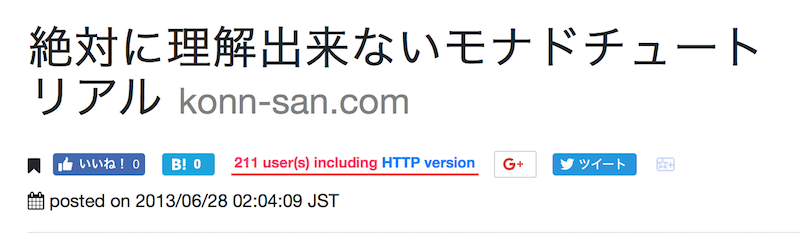
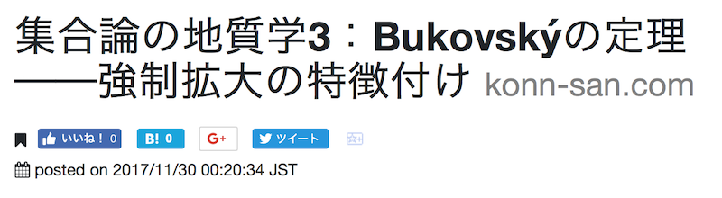

HTTPS に乗り換えた
=================
URLバーを見てもらえれば判ると思いますが、本日を以て konn-san.com コンテンツを全て HTTPS (TLS)ベースにスイッチしました。
これはまあ~~現実逃避~~ <ins>[Chrome が HTTPS 以外は野蛮で危険なウェッブだと宣言するようになった](http://www.itmedia.co.jp/news/articles/1802/09/news066.html)</ins>という話が入ってきていたので、証明書は既に[Let's Encrypt](https://letsencrypt.org)で遥か前に取ってあったしこれを機に乗り換えるかー、と決心した次第です。

Nginxの設定書き換え
-----------------
でまあ僕のサーバは今はリバースプロキシやWebSocketsとかの対応状況を鑑みて [Nginx](http://nginx.org) を使ってるんですが、ウェッブの波に乗った結果ほんの数行設定ファイルを書き換えれば良いということがわかり、これは滞りなく済んだ。

もともとは、

```
server {
  server_name konn-san.com;
  listen 80;

  root /path/to/web/root;
  
  location / {
    try_files $uri $uri/ =404;
  }
}
```

こんな感じだったのを、

```
server {
  listen 80;
  server_name konn-san.com;
  return 301 https://$host$request_uri;
}

server {
  server_name konn-san.com default_server;
  listen 443;
  ssl on;
  ssl_certificate      /path/to/tls/fullchain.pem;
  ssl_certificate_key  /path/to/tls/privkey.pem;

  root /path/to/web/root;
  
  location / {
    try_files $uri $uri/ =404;
  }
}
```

こんな感じにしてやって `sudo systemctl reload nginx`{.sh} とでもすれば、これまで通りに `http://konn-san.com/math` にアクセスしても、自動的に `https://konn-san.com/math` に飛ばされるようになる。やったね！

[2018/02/09 22:35追記]  
Firefoxで開いたら「証明書不正だ」と怒られた。なんだと！Let's Encrypt だぞ！とキレていたが、[このQiita記事](https://qiita.com/Y-dash/items/f0008d8124c1622729f3)

[](https://qiita.com/Y-dash/items/f0008d8124c1622729f3)

によれば、`cert.pem` ではなく`fullchain.pem`を指定する必要があるらしい。
ということで上の設定ファイルも現時点ではそのように書き換えてある。  
[/2018/02/09 22:35追記ここまで]

テンプレート等の書き換え
---------------------
……というだけで済むのなら良かったのだけど、セキュリティ対策ということで**HTTPSサイトからHTTPサイトのリソースは読み込んで貰えない**。
なので、これまでのテンプレートで `http://konn-san.com/css/style.css` みたいにリンクが貼ってあった所をぜんぶ `https://konn-san.com/css/style.css` に貼り替える必要がある。さもないとCSSが読み込まれずデザインが崩れることになる。まあこんなの `find-dired` で一瞬なので問題ない。

あと、弊サイトの出力には [Hakyll](http://jaspervdj.be/hakyll/) を使っているので、そこでの設定もちゃんと `https` になるように以下のように書き換える必要がある：

```haskell
feedConf :: FeedConfiguration
feedConf = FeedConfiguration { feedTitle = "konn-san.com 建設予定地"
                             , feedDescription = "数理論理学を中心に数学、Haskell、推理小説、評論など。"
                             , feedAuthorName = "Hiromi ISHII"
                             , feedAuthorEmail = ""
                             , feedRoot = "https://konn-san.com"
                             }
```

あとはTwitter向けの Card のサムネールとかその辺りのリンクも適宜修正。
全部纏めて再コンパイルしてアップロードし直し、よし！と喜び勇んでアクセスするが……あれ？URLバーに錠前:lock:アイコンが表示されない。
その上、なんかはてブボタンやはてなスターの表示もおかしい。はてブ数は「ゼロ」として表示されるはずなのに、そもそも数が表示されるべき場所がない。

これも結局は外部サイトから読み込んでいるJavaScriptや画像が `HTTP` 経由のものだったためらしい。そういえばはてブやTwitter等へのリンクとか、CDNへのリンクとか、あの辺りは `//cdn.com/hoge/fuga` みたいにしてるのと `http://cdn.com/home` みたいにしてんのがあったと思い出し、その辺りも全部 `//cdn.com/hoge/fuga` に統一してやる。すると、URLバーにもちゃんと錠前が現れ、はてブ数欄とはてなスターも復活した。やったぜ。

はてぶ数との戦い
--------------
さてではこれで終わり……かというと（というくだりは二回も続けば十分）、もう一つ問題がある。
それは、**ソーシャルブクマ数の引き継ぎ**である。

URLが変わるわけだから、ソーシャルブクマのデータも新しい `https://~` から始まるアドレスに対しては全部ゼロである。
だから、我がサイトのキラーコンテンツである [性格の悪いモナドチュートリアル](../prog/never-understood-monad-tutorial.html) とか [`latexmk`の使い方講座](../prog/why-not-latexmk.html)とかのそこそこいっていたデータが全部飛んで、全部「ブクマ0」になってしまう。

まあ、Google+とかFacebookのいいねとかの数はどうでもいいんだが、私はインターネット老人に片足を突っ込んでいるので、はてブ数は引き継ぎたい[^2]。
サービスによっては `301 Moved Permanently` で飛ばしてあればよしなにしてくれるものもあるらしいが、はてブはそういう事はやってくれないらしい。
それどころが、調べたところ[はてブはデータの法人相手の有償サービスとしてしかやっていない](https://www.akiyan.com/blog/archives/2017/04/akiyan-dot-com-ssl.html)らしい。阿漕な商売やで……[^1]。

では、そもそもブクマボタンを**古いHTTPのリンクのままにする**というのはどうか？
`http://~` から `https://~` に自動転送されるのだから、これは問題ない筈……ということでタグを弄って以下のようにしてみる：
```html
<a href="//b.hatena.ne.jp/entry/http://konn-san.com/index.html" ...>
  
</a>
<script type="text/javascript"
        src="//b.st-hatena.com/js/bookmark_button.js" ...>
</script>
```
しかし、こうしても**勝手に `https://` に直されたページに飛ばされる**。
囲い込んでやがんなぁ……というので上の `//` を `http://` に戻すのはよくなくて、上で**折角獲得した:lock:アイコンが消える**。
セキュアにしようと思ってやっているのだから、このバッヂを手放すのはまあ本末転倒でじゃあHTTPのまんまでいいだろうとなる。

### 失敗する試み：`<iframe>`{.html} の書き換え
色々と調べていると、はてなブックマークのAPIが公開されている。

[](http://developer.hatena.ne.jp/ja/documents/bookmark/apis/getcount)

これを使って、はてブが自動で生成するボタンの内容を書き換えられないか？というのが自然に現れる。

しかし、これは上手くいかない。なぜなら、**はてブボタンは外部URLへの `<iframe>`{.html} 要素として実現されている**からだ。
CSRFとかを防ぐためにも、JavaScriptを使って外部URLへの `<iframe>`{.html} の内容を書き換えることはできないので、直接はてブボタンを弄る作戦は上手くいかないのだ。

### 今回取った作戦：「合計はてブ数欄をつくる」
仕方がないので、**はてブボタンの横にHTTP版との合算を自前で挿入する**ことにした。
ということで書いたのが次のコードである：

```javascript
$(document).ready(function(){
    var urlBody = location.href.replace(location.protocol, "");
    var protos =  ["http", "https"];
    var query = "?";
    for (i = 0; i < 2 ; i+=1) {
        var parts = encodeURIComponent(protos[i] + ":" + urlBody);
        query += `url=${parts};`;
    }
    var url = "https://b.hatena.ne.jp/entry.count" + query;
    $.ajax({
        url: url,
        type: "GET",
        crossDomain: true,
        dataType: 'jsonp'
    }).done(function(data) {
        if (Number(data) > 0) {
            var li = $("<li>");
            var msg = "";
            msg += data;
            msg += " user(s) including ";
            var link = $("<a>").text("HTTP version").attr('href', "http://b.hatena.ne.jp/entry/http:" + urlBody);
            $('<span>').attr("id", "old-bookmark-numbers").text(msg).append(link).appendTo(li);
            li.insertAfter("#social #hatena-bookmarks")
       }
    });
});
```

注意点は、**上のはてなのAPI文書そのままのURLは機能しない**ということである[^4]。
なぜか。それは `http://api.b.st-hatena.com/entry.count?url=...` というURLを見るとわかってそうこのエンドポイントはHTTPなのだ。
だからこれまで散々述べてきた理由によって**HTTPSページからJS経由で叩くことができない**。
ではどうするのか……というと、[ありがたい事にこのページ](https://blog.hinaloe.net/2015/08/15/hatena-bookmark-api-on-ssl/)に書かれている **`https://b.hatena.ne.jp/entry.count` というエンドポイントを使えばよい**。

[](https://blog.hinaloe.net/2015/08/15/hatena-bookmark-api-on-ssl/)

というわけで上のコードが出来あがった。見てくれはこんな感じになる：

<a href="../prog/never-understood-monad-tutorial.html"></a>

はてブの横に "211 user(s) including..." とか書いてあるのがわかると思う。
横に長すぎるきらいがあるが、ちゃんと「HTTP版のですよ」っていうエクスキュースは必要だし、まあ仕方ないと思おう[^3]。
一方、悲しいことに元々一切はてブが付いていなかった場合は次のように省略されるようになっている：

<a href="../math/geology-bukovsky-theorem.html"></a>

かなしいなあ。かなしい。かなしいので皆さんブクマしていってください。


# まとめ
まあとにかくこんな感じで、弊サイトはHTTPSに乗り換えました。
ちゃんと乗り換えられたということがわかりたいので、みなさんも弊サイトにはてなスターとはてなブクマをやっていってください。

[^1]: **[以下SEO屋の悪口]**  
  ところで、リンクしたページ以外にもHTTPS移行後はてブ消滅問題を扱っているページは幾つか見付かったんだけど、SEO対策を謳っているサイトに載っているPHPによる対応策のコードが全然整形されておらず読み辛いのには大変笑った。PVを気にする余り何か大切なものを置いてきてしまったのだろうか。以下でjQueryによる対応策を述べているが、SEO屋のコードは読み辛くてそもそも読んでいないので、全く参考にしていない。悪しからず。  
  **[/SEO屋の悪口終わり]** 

[^2]: はてなスターは最近設置したばかりなのでまだゼロ個しか貰っていなかったから無傷。

[^3]: スマホでみると縦に分割されてちょっと見苦しいのでなんとかしたいんだけどね……。

[^4]: あとこれは本筋に関係ないんだけど、勘でJavaScriptを書いているので、特に何も考えず最初は jQuery の Slim 版を読み込んでいた。こいつらは `jQuery.ajax`{.js} とかが省かれているが故の「スリム」版なので、最初は上のコードが通らずにウーン何故だ……と無駄に悩むことになった。
