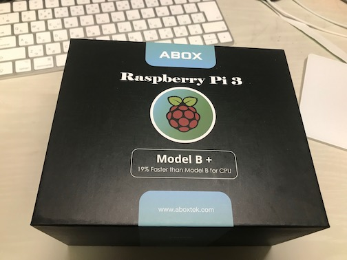
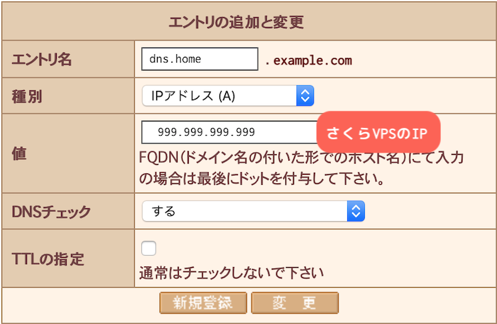
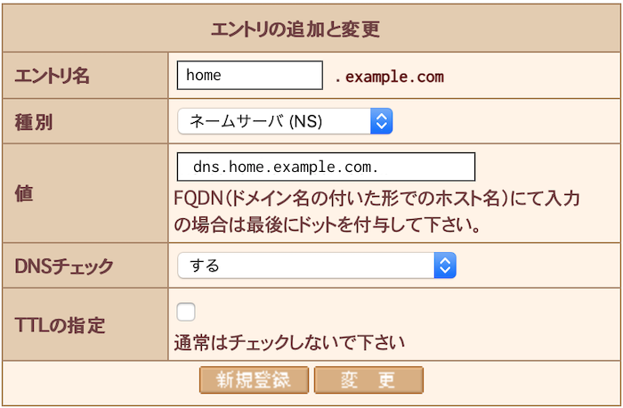

# 発端

1月中頃につくばから都内に引っ越したんですが、光インターネットを契約したところ、ルータに VPN サーバの機能がついていた。
大学の VPN は博士を修了したら使えなくなってしまうし、出先や海外から自室ネットワークにアクセスできると何かと良いことも多かろう、ということで、さっそく使うことにした。
しかし、一つ問題があって、今契約している回線は固定 IP ではないので、定期的にグローバル IP が変わってしまう。
ルータの機種によっては、グローバル IP が変わったら自動通知してくれるものもあるようだが、残念ながら私が貸し出されたルータにその機能はなかった。

そこで、折角なの Raspberry Pi でも買って、一定期間ごとにグローバル IP をチェックし、変更があったら DNS を更新するようなシステムを作ることにした。

以下、その手順を書いていくが、普通の Debian 同然なのであんまり RasPi 特有のことがなく、どちらかというと BIND9 の設定の仕方とかが本質的に効いている。

## 素材

こちらが今回買った Raspberry Pi Model B+ です：

[](asin:B07FQ9678G)

[](asin:B07FQ9678G)

ケースや電源ケーブル、microSD、ヒートシンクなどもついて1万弱。
こういうのをやるのは初めてだったので、最初金色と銅色の正方形の板が何なのかよくわからなかったが、これがヒートシンクで、チップの両面に貼り付けると良い感じに熱を逃がしてくれるやつだった。
どうせ記事を書くんだから写真撮ればよかったが撮らなかった。まあ付属品に金色と銅色の正方形の板は1枚ずつしか入っていないのでわかるだろう。

# 手順

## 構成の概略

* さくらドメインで取った独自ドメインのサブドメインでVPNにアクセスしたい
* 通常のサブドメインはさくらのドメイン管理コンパネでよろしくやっている
* 独自ドメインはさくら VPS にマップしてあり、今回はこの VPS 上で更に BIND を動かす。

以下、例としては `example.com` が独自ドメインだと仮定し、以下のような構成にする：

* `example.com` 全体：さくらのネームサーバで管理
* `home.example.com` ゾーン：さくらVPS上に建てた BIND9 で管理
  * `dns.home.example.com`：さくら VP*S*上の BIND9 へのアドレス
  * `vpn.home.example.com`：自宅 VP*N* へのアクセスポイント

また、IPのプレースホルダとして以下を用いる：

`1.2.3.4`
:    初期状態（現在）の自宅のグローバルIP。`curl inet-ip.info` や `hostname -i` などで調べられる。

`999.999.999.999`
:    さくらVPSの固定グローバルIP。

## Raspberry Pi の初期設定

セットアップには、まず microSD に OS をインストールする必要がある。
実機だけでインストールを行うには外付けの USB キーボードとマウスが必要なようで少し焦ったが、ふだんラップトップに Bluetooth で繋いでいる Magic Keyboard と Magic Trackpad 2 を USB ケーブルで繋いだら普通に使えたので良かった。

[](asin:B016ZF8RDA)
[](asin:B016ZE7K8O)

説明書に従い、キーボード、マウス（今回はトラックパッド）、外付けディスプレイを繋ぐ。
電源ケーブルを刺すと勝手に起動し、OSのインストール画面に移る。
途中で必要なファイルをダウンロードするので、ここで Wi-Fi の設定なり LAN ケーブルを繋ぐなりしておく。
最初は何かダウンロード出来ずに失敗していたが、再起動してもっかいやったらうまくいった。何だったんだろう。

後で知ったのだが、PiBakery とかいうのを使うと、ブート用の microSD にカスタマイズした Raspbian などをインストールできるようだ。

[](https://www.pibakery.org)

てか今みたらホスト名の設定とかも出来るっぽいし、これをちゃんと使えば後の設定の手順も結構省けたかもしれない。
不覚。

### アカウント名、パスワード、ホスト名、SSHの設定

セキュリティホールになるので、アカウント名やホスト名を初期から変更する。
以下では `admin` という（ザルな）名前にデフォルトアカウント名が変更されているものとする。
この辺、完全にただの Debian なので、この辺りを参照してよしなにすれば良い：

[](https://qiita.com/kenchang/items/849c82f16ba5eafe070d)

[](https://qiita.com/naoyukisugi/items/66fd21512da75b437465)

SSH の設定はまあ、適当にいつものように `/etc/ssh/sshd_config` をいじってやれば良い。
まじで Debian なので、RasPi 特有の書いておくべきことがほとんどないね。

### ファイアウォール

念のため、ローカルのネットワークからしかアクセスを受け入れなくする。
ローカルIPの範囲が `192.168.0.0/24` のときは以下のようにすれば良い：

```zsh
$ sudo apt-get install ufw            # iptables とか知らないので簡単な ufw を使う
$ sudo ufw default DENY               # デフォルトではあらゆる接続を拒否する
$ sudo ufw allow from 192.168.0.0/24  # 同一ネットワーク内からの接続のみ許可
```

## サーバ側の設定

まずさくら VPS 上に BIND をインストールする。
さくらVPSの構成は以下の通り：

```zsh
$ cat /etc/os-release
NAME="Ubuntu"
VERSION="16.04.4 LTS (Xenial Xerus)"
ID=ubuntu
ID_LIKE=debian
PRETTY_NAME="Ubuntu 16.04.4 LTS"
VERSION_ID="16.04"
HOME_URL="http://www.ubuntu.com/"
SUPPORT_URL="http://help.ubuntu.com/"
BUG_REPORT_URL="http://bugs.launchpad.net/ubuntu/"
VERSION_CODENAME=xenial
UBUNTU_CODENAME=xenial
```

まず BIND9 をインストールする [^1]：

```zsh
$ sudo apt-get install -y bind9
...
$ sudo systemctl stop bind9
```

設定をこれから弄るので、一旦止めておく。
どうせ何も設定していないし、どうもゾーンファイルを弄るときには止めておいたほうがいいらしい。

BINDの設定ファイルは `/etc/bind/named.conf` だが、デフォルトでは以下のような内容になっている：

```/etc/bind/named.conf
// This is the primary configuration file for the BIND DNS server named.
//
// Please read /usr/share/doc/bind9/README.Debian.gz for information on the
// structure of BIND configuration files in Debian, *BEFORE* you customize
// this configuration file.
//
// If you are just adding zones, please do that in /etc/bind/named.conf.local

include "/etc/bind/named.conf.options";
include "/etc/bind/named.conf.local";
include "/etc/bind/named.conf.default-zones";
```

早い話が、BINDのオプションについては `/etc/bind/named.conf.options` に、自前のゾーン設定については `named.conf.local` に記述するということである。

[^1]: 安全を期するなら、コンテナの中でやった方がいいかも

### 更新鍵の生成

次に、Dynamic DNS で更新の際に使う鍵一式を生成する。
日本語で読めるリソースだと、秘密鍵を生成する方法の記事ばかりがヒットする。
しかし、 `nsupdate` のクエリが TLS などの暗号化を用いているセキュアなものなのか、調べた限り良くわからなかったので、大事を取って公開鍵方式の鍵を使うことを考える。

まず、次のようにして鍵を生成する（`vpn.home.example.com` の部分は自分の独自ドメインになる）：

```zsh
$ pwd
$ dnssec-keygen -T KEY -a RSASHA256 -b 2048 -n HOST vpn.home.example.com
Generating key pair.................................................................
....................................+++ ............................................
....................................................................................
...................+++
Kvpn.home.example.com.+008+12345
```

するとワーキングディレクトリに `Kvpn.home.example.com.+008+12345.key` および `Kvpn.home.example.com.+008+12345.private` という鍵対が生成される。
`+`以下は生成する度にちがうようで、最後の`12345`の部分がどうも ID 扱いになるらしい。
この二つのファイルは、`nsupdate` で呼び出す時に必要になるので捨ててはいけないし、バレたら更新出来るようになってしまうので、絶対に秘匿する必要がある。

次に、ゾーンの設定をする。次の内容を `/etc/bind/named.conf.local` に追記する：

```conf
zone "home.example.com" {
     type master;
     file "home.example.com.zone";
     update-policy {
       grant vpn.home.example.com. name vpn.home.example.com. A;
     };
};
```

これで、「ゾーンの具体的な設定は `/var/cache/bind/home.example.com.zone`を参照」「`vpn.home.example.com` を動的に書き換えられるのは、上の `.zone` ファイルで指定された鍵を持っている人のみ」という意味になる。

今度は `/var/cache/bind/home.example.com.zone` を弄ることになるが、鍵の設定はこのゾーンファイルに書くことになるので、先程生成した公開鍵の内容をメモっておく：

```zsh
$ cat Kvpn.home.example.com.+008+12345.key
vpn.home.example.com. IN KEY 512 3 8 ABCDEFGHIJKLMNOPQRSTUVWXZ...=
```

これを踏まえて、home.example.com のゾーンの設定をしていく。
ここでは、VPN サブドメインの設定、VPN設定の更新鍵の設定と自前BINDへのアドレスの設定を行う。

```/var/cache/bind/home.example.com.zone
$TTL 86400      ; デフォルトの生存期間（1日）
home.example.com    IN SOA  dns.home.example.com. root.home.example.com. (
          2019031009 ; シリアル番号、日付＋二桁のユニークIDにする。
          3600       ; 更新間隔 (秒、ここでは 1 時間)
          900        ; リトライ間隔 in 秒 (15 minutes)
          604800     ; 有効期限 (1 week)
          3600       ; 最小の生存期間 (1 hour)
          )
          NS      dns.home.example.com.   ; VPS で動かす BIND へのドメイン
$ORIGIN home.example.com.

; vpn.home.example.com に紐づけられた鍵
vpn       KEY     512 3 8 (ABCEDFGHIJKLMNOPQRSTUVWXYZ=...
                          ...=
                          ) ; key id = 12345
$TTL 3600       ; 1 hour
vpn       A       1.2.3.4   ; 初期状態の自宅グローバルIP

$TTL 86400      ; 1 day
dns       A       999.999.999.999   ; さくらVPSの固定IP
```

上の `root.home.example.com` はメールアドレスを表現するらしく、この場合一つ目の `.` を置き換えて `root@home.example.com` が連絡先メールアドレスとして登録されることになる（らしい）。
上の `.key` ファイルの `IN` 以後の3つの数字が、ここでの `vpn` KEY 以後の括弧前の `512 3 8` に相当するので、写しておく。
括弧内は、最後にスペース区切りで書かれているハッシュ値をうつす。

括弧内では改行等が効くらしく、`ABCDEFGHIJKLMNOPQRSTUVWXZ...=`部分はスペースごとに改行・インデントすると読みやすい。
`;` 以後はコメントになる。

### さくらドメインネームサーバの設定

さくらの会員メニューにログインする：

[](https://secure.sakura.ad.jp)

「契約サービスの確認」＞「ドメインの確認」と飛んで、ページ最下部の「ドメインメニュー」をクリック。
「ネームサーバとゾーンの管理」から、今回設定したいドメインの欄の「ゾーン編集」を選び、「変更」に飛ぶ。

まず、DNSサーバへのサブドメインを設定する。
以下のように入力し、「新規登録」をクリックする。



ここで続けて `home` サブドメインを設定しようとすると上手くいかないことがあるので、一旦「データ送信」を選ぶ。
今度は今設定した DNS サーバに `home.example.com` 以下を委譲する設定を以下のようにし、「新規登録」→「データ送信」をする。



### ファイヤウォールまわりの設定

VPS で特にファイヤウォールを動かしていないなら、上の設定だけで問題ない。
しかし、常識的に考えて VPS も UFW によるファイヤウォールで守られている筈なので、このままだとDNSサーバにアクセスできない。
そこで、まず53番ポートを開けておく：

```zsh
$ sudo ufw allow 53
ルールを追加しました
ルールを追加しました (v6)
```

この作業を怠っていたので、1時間くらい「設定合ってる筈なのに何も動かない……」となって泣いた。
また、BIND9はデフォルトでランダムなポートにフォールバックするようになっているらしく、このままだとまだ動かないので、BINDを53番ポート固定にしておく必要がある。
以下のように、`/etc/bind/named.conf.options` の `options{ }` 節の末尾に 53 番ポートに固定する設定を加える：

```/etc/bind/named.conf.options
options {
  ...
  query-source address * port 53;
}
```

### BIND9 起動

```zsh
$ sudo systemctl start bind9
```

これで多分 VPS 上の DNS は無事動き始める筈である。
設定が上手くいっていることを確かめるため、`nsupdate` を VPS 上で呼んでみよう。
先程キーを生成したディレクトリに行って、以下を実行してみる。

```zsh
[vps]
$ nsupdate -k Kvpn.home.example.com.+008+12345.private <<EOF
server 999.999.999.999
update add vpn.home.example.com. 3600 IN A 1.2.3.4
send
quit
EOF
```

特に何も言われなければ成功。`3600` の部分はキャッシュが何秒残るかを表している。

DNS設定が浸透するまでにちょっと時間がかかるので、外部からのアクセスが出来るようになるには、少し待つ必要があるかもしれない。

## グローバル IP 自動更新スクリプト

RasPi 上に戻る。
VPS上から適宜生成したキーペアをコピーしてくる。

```zsh
[raspi]
$ mkdir ~/.keys
$ scp vps:/path/to/keys/Kvpn.home.example.com.+008+12345.key     ~/.keys
Kvpn.home.example.com.+008+12345.key      100%   16     1.5KB/s   00:00
$ scp vps:/path/to/keys/Kvpn.home.example.com.+008+12345.private ~/.keys
Kvpn.home.example.com.+008+12345.private  100%   16     1.5KB/s   00:00
```

これを使えば `nsupdate` でDNS情報を更新出来る筈なので、さっき実行したのをもっかい実行してみる。

```zsh
[raspi]
$ nsupdate -k ~/.keys/Kvpn.home.example.com.+008+12345.private <<EOF
server 999.999.999.999
update add vpn.home.example.com. 3600 IN A 1.2.3.4
send
quit
EOF
```

怒られなければ成功。
あとは更新スクリプト `update-ip.sh` を適当に書き、パスの通った場所に置く。

```bash
#!/usr/bin/env bash
IP_FILE="${HOME}/.batch/global_ipaddr"
OLD_IP=""
IP=`curl inet-ip.info 2>/dev/null`
if [ -f "$IP_FILE" ]; then
    OLD_IP=$(cat "${IP_FILE}")
fi

if [ -n "${IP}" ]; then
    if [ "${OLD_IP}" != "${IP}" ]; then
        echo "IP changed to ${IP}, from the old ${OLD_IP}"
        echo "UPDATING DynDNS..."
        nsupdate -k $HOME/.keys/Kvpn.home.example.com.+008+12345.private <<EOF
        server dns.home.example.com
        update add vpn.home.example.com. 3600 IN A ${IP}
        send
        quit
EOF
        echo "Updated."
        echo "${IP}" > "${IP_FILE}"
    else
        echo "IP ${OLD_IP} remains the same: ${IP}"
    fi
fi
```

古い情報は `$HOME/.batch/global_ipaddr` に保存することにして、適宜 `mkdir $HOME/.batch`{.zsh} などしておく。
実行権限を付与し、ちゃんと動くことを確認しておく。

```zsh
$ chmod +x update-ip.sh
$ update-ip.sh
IP changed to 1.2.3.4, from the old
UPDATING DynDNS...
Updated.
```

あとはこれを定期実行すればよい。
cron は人間が触るものではないので、ここでは systemd を使うことにする。
以下のファイルを作成する：

`/etc/systemd/system/update-ip.service`:

```toml
[Unit]
Description=Updates global IP address

[Service]
Type=oneshot
ExecStart=/home/admin/bin/update-ip.sh
WorkingDirectory=/home/admin
User=admin
Restart=no

[Install]
WantedBy=multi-user.target
```

`/etc/systemd/system/update-ip.timer`:

```toml
[Unit]
Description=Periodically renews global IP address info

[Timer]
OnBootSec=1min
OnUnitActiveSec=15min
Unit=update-ip.service

[Install]
WantedBy=timers.target
```

ここでは、起動1分後から、以後15分刻みで定期実行されるようにしてある。
あとはこれらを有効化すれば良い。

```zsh
$ sudo systemctl enable update-ip.service
$ sudo systemctl enable update-ip.timer
$ sudo systemctl start  update-ip.timer
...
```

以上で、あとは放っておけば遅くとも15分おきに情報が更新され、何も考えずに `vpn.home.example.com` から自宅 VPN に繋げられる筈である。

# 最後に

そうは言っても、15分のラグが出うるので、ひみつの場所からグローバル IP の情報にアクセス出来るようにすると良い。
私は適当に Let's Encrypt で証明書を取って、TLS + Basic 認証で秘匿された場所に IP の情報をアップするようにしている。
この辺りのことを書いてもよかったが、あとは完全に個人が何のツールを使っているかに依存するので、詳しくは書かない。
あ、あとここで指定したサブドメイン等は私の本番環境での設定と一致しているとは限りませんので悪しからず。攻撃はやめてね！

ここ改善したら？みたいのがあったら教えてください。ではでは。
