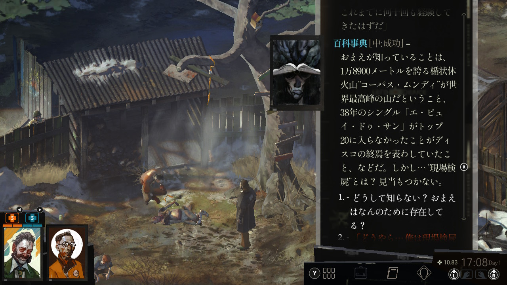
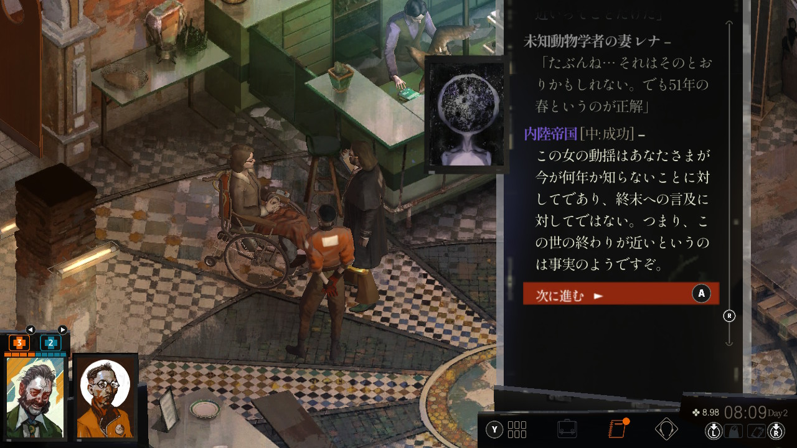
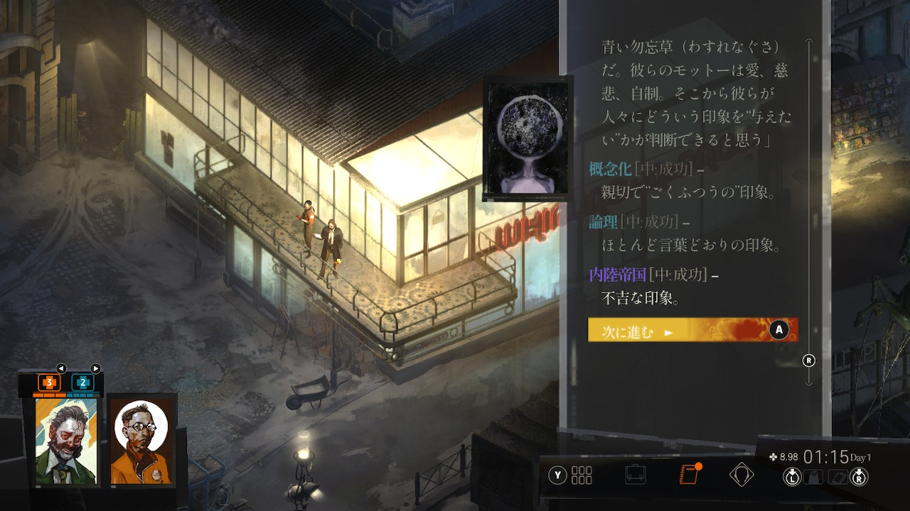

# 新年の挨拶も早々にゲームの布教をする

Disco Elysium というゲームがある。
2019年に発売されたエストニア産のゲームで、私がその存在を知ったのは確か以下のツイートがRTされてきたのがきっかけだったと思う：

<blockquote class="twitter-tweet">
記憶喪失の刑事が陰鬱な町で起きた殺人事件の真相を24もの自分のスキルと脳内会議しながら推理するという 、ゲーム賞取りまくったオープンワールド怪物ボリュームミステリーRPG「Disco Elysium」が翻訳希望投票を始めた！日本はまだ5位！これ遊べないのは大損！皆投票しよう！<a href="https://t.co/z4KlkgwsOF">https://t.co/z4KlkgwsOF</a> <a href="https://t.co/UyqcyVhre0">pic.twitter.com/UyqcyVhre0</a>
&mdash; タンサンあさと (\@tansanasa) <a href="https://twitter.com/tansanasa/status/1260812736830689281?ref_src=twsrc%5Etfw">May 14, 2020</a></blockquote> 

去る2022年8月に遂に日本語訳が出たので、悪いことは言わないので是非買ってやってほしいというのが、よりにもよって2023年の新年早々に久々にこのサイトを更新した動機になる。新年明けましておめでとうございます。
翻訳は、エイドリアン・マッキンティの〈刑事ダフィ〉シリーズなどを手掛ける武藤陽生氏が担当しており、しばしば難解と言われる本ゲームの膨大な英語を雰囲気そのままに見事に訳出されているので安心してほしい。

私はといえば、8月にSwitch版を購入して以来、ちまちまと週末に進めたりしていた。
謎めいた頽廃的な雰囲気が催眠的でたいへん心地良く、とはいえ作品世界に没入するのは体力を使うので、仕事がそこそこ忙しかったのと他の予定があったのもあり、少しだけ進めて数ヶ月放置していた。
年末年始にまとまった休みをとることにしたので、じゃあ帰省に合わせて一週間くらいかけてゆっくり遊ぶか、とプレイを再開したところ、二時間弱の電車移動が一瞬に感じるほど熱中してしまい、忘年会から帰る終電を降りても目が話せず、久し振りに「終電を降りた駅のホームで区切りのいいところまで小説を一気読みする奴」をやった。ゲームじゃん、って？本作はかなりのボリュームのテキストから成る（[一説による](https://news.denfaminicogamer.jp/kikakuthetower/200630z)とハリー・ポッターシリーズ全七巻分）ので、もう小説といっていいでしょう。
結果、年末年始に一週間くらいかけてゆっくりやるつもりだったのが、忘年会の終電を降りたあとはもう実家の自室で明け方の5時くらいまで熱中してエンディングまで一気呵成に辿り着いてしまった。
これは本当にやばいぞということで、ミステリや SF を好む友人知人や赤の他人に布教する目的で筆を執ったという次第。

# Disco Elysium とはどんなゲームなのか？

冒頭で引用したタンサンあさとさんのツイートが簡潔にこのゲームを要約して下さっている。
**アル中で記憶喪失の男となって、脳内の幾つものスキルと会話しながら、頽廃的な都市で吊るされた男の死の真相を追う**というものだ。

この時点で興味を持った方は、それ以上の情報を入れずにゲームに没入していただいたほうがいいので、以下の記事は読まずにそのまま購入＆プレイに没頭して頂くのがよいだろう。
というのも、この主人公の男は自分の人生に関する記憶だけではなく、**作品世界の歴史・成り立ち記憶までも失っており**、事件の謎だけではなく**そもそもこの世界は何なのか？という謎も含めて追求する**というのが大きな醍醐味になっており、主人公に寄り添って作品世界に没入する魅力の一端を成しているからだ。
Steam （Win/macOS 両対応）や PlayStation、Switch で遊ぶことができる。私は Switch 版を買ったが、操作性はちょっと悪い程度で体験を損わずにちゃんとプレイはできたが、もともと PC ゲームなので、マウスクリックができる Steam のものを買うのが楽かもしれない。

まだ様子見をしている御仁に向け、蛇足を承知で重篤なネタバレを極力避けながら、Disco Elysium とはいかなる作品なのか紹介していこう。

本作を一言でいうなら、**腐敗が蔓延る頽廃した新・新大陸植民地の港湾都市を舞台にした、レトロパンク異世界幻想SF・ハードボイルド・サイコ探偵・オープンワールドアドベンチャー電子TRPGノベルゲーム**だ。随分とてんこもりだと思うだろう。しかし、このゲームの過剰さを表現するには、これでもちょっと短かすぎるくらいだ。

以下、それぞれの要素について説明させてもらおう。

## 作品の舞台〈マルティネーズ〉と核となる事件について

上でちらっと述べたように、この作品では**事件の秘密と世界の秘密が密接に絡み合っており**、我々の知る世界とは異なる歴史を歩んでいる。
作品の舞台は、〈新・新世界〉としてしられるインスリンデ群島を構成する国家の一つレヴァショール、そのかつての中心地であった**港湾都市・マルティネーズ**を、記憶喪失の男が事件と自身と世界の秘密を求めて彷徨い歩くというのが本作のコンセプトだ。
この世界はいかなる世界なのか？というのを解き明かすのもこのゲームの重要な要素の一つなので、そこまで深い説明はしないが、徐々に浮かび上がる世界像それ自体も魅力の一つなので、ここではその一端を説明しておこう。

ゲームの冒頭、男は荒れ果てたホテルの一室で奇妙な夢目覚める。ソファベッドはめちゃくちゃで、あたりに酒瓶と服とが散乱している。
<ruby><rb>宿酔</rb><rp>（</rp><rt>ふつかよ</rt><rp>）</rp></ruby>いの頭を抱えてシャワー室に向かうと、鏡に映ったのは奇妙な笑顔を貼り付かせた見知らぬ男の顔だった。

部屋を出てホテルをさまよううち、他の宿泊客やバーテンダー……もとい、カフェテリア経営者らと出会って、自分の蛮行を知る。どうもかなり荒んでいたらしい。
ホテルのロビーには、自分とバディを組んで事件を捜査すべく別の署から派遣されてきたキム・キツラギ警部補がいて、どうも自分はレヴァショールの**警察機能を担う「レヴァショール市民軍（Revachol Citizens Militia; RCM）」のいち捜査官であるらしい**ことがわかる。
主人公はアルコールに冒されて完全に記憶がパアになってしまっているので、こんな説明を訊いても一向にピンと来ない。

事件は主人公が宿泊するホテルバー〈ワーリング・イン・ラグズ〉の裏庭で起きた。
マルティネーズを訪れていた傭兵の死体が木に吊るされた状態で発見されたのだ。
しかも、死体は住民の誰もが見ていたにも関わらず、匿名の市民がRCMに通報するまで発生から一週間放置されていたというのだ。

何故それまでずっと放置されていたのか？それには、このマルティネーズ、ひいてはレヴァショールが辿った歴史の特殊性が関連している。
マルティネーズは港湾都市で、時あたかも労働組合と巨大企業の抜き差しならない睨み合いが続いている。労働組合の権力は絶大で、街を支配していると言ってよく、組合傘下のごろつき自警団〈ハーディ・ボーイズ〉が実質的な地域の警察として君臨している。
被害者の傭兵はスト破りのために企業側に雇われていた男で、事件の直前〈ハーディ・ボーイズ〉と揉め毎を起こしていた。だからこの事件には〈ハーディ・ボーイズ〉が関っている、というのは住民たちの間では公然の事実だった。彼らに睨まれれば、この街では暮らしていけない。そんな状況でRCMに通報するような住民がいるはずもなかった。では、誰が通報したのだろう？──これも重要な謎だ。

そもそも、RCM は市民から必ずしも良い印象を持たれていない。
それはこのレヴァショールの成り立ちに関りがある。
レヴァショールでは半世紀ほど前に共産主義革命が発生し、一時期権力を握った。
しかし、大国の同盟組織〈連合〉が内戦に介入した結果革命は頓挫して、現在レヴァショールは〈国際倫理機関〉の統治下で事実上外国勢力の植民地の扱いを受けているのだ。
RCMはこの大国たちから唯一法執行の権限を与えられた組織であり、だから市民たちからみればRCMは外国勢力の手先でしかないのだ。

このような逆風の中で、主人公は時折蘇える過去の記憶と自らを責め苛む夢に魘されながら、宿賃をチマチマと稼ぎつつ、市民のお願いをきいたり街の権力者たちにとりいったり、不良少年といっしょにダンスホールを作ったり、共産主義者になってみたりしながら、事件、自身、世界の秘密を迫っていく──それが Disco Elysium だ。

## レトロパンク異世界幻想SF

**レトロパンク**というのは私が今適当に考えた言葉で、本当にあるのかは知らない。無線通信やテープのようなレトロな技術の上に計算機文明が築かれているという意味でスチームパンクのような世界観だが、蒸気機関がそこまで重要な役割を果している訳でもないので、とりあえずレトロパンクと呼んでみた。
この世界では、無線電波を介して様々な処理を行う〈ラジオコンピュータ〉が普及している。
記憶素子〈フィラメント・メモリー〉を差し込んで無線越しにオペレータに復号してもらうことで、様々な記録を読んだり、情報を印刷したりすることができる。
捜査が進むに従って、こうしたガジェットを介して世界の「異常」が浮上したりもするし、また、作中では「テープを使った革新的なコンピュータ」が、頓挫した幻のイノベーションとして言及されたりもする。

また、この島には未確認動物を研究する夫妻が訪れており、この島に住む未確認の固有種・インスリンデナナフシの捕獲を試みている。この不思議な巨大生物は普段は葦に擬態しており人間の知覚機能を阻害するので、少数の目撃報告の他はこれまで人類に確認・捕獲されることなく見過ごされてきた──夫妻はそう主張する。
主人公はこの夫妻に話を訊き、暇つぶしにあるいはその存在を自らも信じて、その捕獲を手伝うこともできる。
もちろん、相棒のキツラギ警部補を含め多くの人はこんな荒唐無稽・幻想的な種の存在を信じてはいない。それでも、こんなものが存在してもおかしくないと思える程度には、この世界は神秘のヴェールを纏っている。
この世界ではで〈イノセンス〉と呼ばれる数名の歴史上の神秘的な指導者がおり、それぞれが人類史に大きな影響を与えているらしい──といった事実が次第に明らかになっていくが、こういった我々の世界から見て異質な異世界設定も、もしかしたらこんな幻想種がいてもおかしくないのかも……という感覚を補強する。

我々が主人公に寄り添って駆け巡るレヴァショールという土地は、そうした我々世界とは違う歴史・地理・技術を持った異世界なのだ。

## ハードボイルド・サイコ探偵

ミステリとして分類するなら、本作は**ハードボイルド・サイコ探偵小説**だろう。主人公は記憶喪失であるのみならず、何か起きるたびに24もの人格化された個性的なスキルたち──論理、百科事典、修辞学、演劇、概念化、視覚計算、意志力、内陸帝国、共感、権威、団結心、暗示、耐久力、痛覚閾値、肉体装置、電気化学、悪寒、薄明、手と眼の協調、知覚、反応速度、才覚、手さばき、平静──が何かを見たり聞いたりする度に脳内でのべつ幕なしに好き勝手に会話を繰り広げ、それらに影響されながら主にディスコ文化に偏った奇行を繰り広げるサイコ野郎だ。「俺は黙示録刑事だ！」といいだしたり、相手の秘密がわからなくなり急に脈絡なく服を脱ごうとしたりする。
これらのスキルは捜査をする上で必須の能力・知識を提供してくれる一方で、隙あらば主人公を共産主義陣営にオルグしようとしたり、逆にレイシストのファシストに育て上げようとしたりしてくる。

<figure class="figure mx-auto">
  
  <figcaption class="figure-caption">急に脳内から話し掛けてくる〈修辞学〉。この後主人公は〈修辞学〉に「共産主義」の再構築をするようオルグされる</figcaption>
</figure>

この銘々かってに喚き散らしたり勝手に脳内で会話劇を繰り広げたりするスキルたちがまた素晴しい。幾つかお気に入りの例を挙げよう。

「百科事典」は何かを眼にする度にそれにまつわる蘊蓄を教えてくれて世界観を広げてくれるが、一方で今知りたい肝心の知識を知らずにトボケて全然違うことを話してきたりすることもあり、愛嬌がある。

<figure class="figure mx-auto">
  
  <figcaption class="figure-caption">現場検屍について知りたいのに、無関係な世界最高峰の話をしてくる〈百科事典〉</figcaption>
</figure>

「内陸帝国」は直感やオカルト的思考を司るスキルで、これが発達すると無生物や死体と会話した（つもりになった）りして手掛かりを得ることができるようになる。陰謀論的な思考に近い。

<figure class="figure mx-auto">
  
  <figcaption class="figure-caption">勝手に「世界の終末」を早合点する〈内陸帝国〉</figcaption>
</figure>

「演劇」は相手の嘘を見抜いたりする能力にあたる。こいつも時々的外れなことを言い、他のスキルたちから袋叩きにあったりするかわいげがある。

<figure class="figure mx-auto">
  
  <figcaption class="figure-caption">手掛かりに対して銘々勝手な印象を話す脳内スキルたち。</figcaption>
</figure>

<figure class="figure mx-auto">
  
  <figcaption class="figure-caption">〈団結心〉は広い意味で仲間の心理などを推し量ったり、相手に共感してもらったりするのに使われる。キツラギ警部補は最高のバディ。</figcaption>
</figure>

また、こうした捜査に必要なスキルに加えて、夢や気絶中でのみ主人公に語り掛けてくる人格的存在もある。たとえば、ゲームの始まりはこんな感じだ。

ゲームを開始すると、プレイヤーが直面するのは、全き闇と物悲しい音楽。その闇のなかから、〈古代爬虫類脳〉の嗄れた声がこちらに語り掛ける。

> そこには何もない。生暖かい原初の闇があるだけだ。おまえの意識はその中で発酵していく。それは麦の穂先のひと粒にも満たぬほど小さい。おまえはもう何もしなくていい。
>
> この先ずっと。
>
> 永遠に。

「（非存在のままでいる）」などと返答しながら、この抽象的な問答を進めていく。
選んだ返答によって、長い虚無の中に沈み込んでいきもするが、やがて主人公の非存在は許容できなくなり、次第に現実に対する感覚器官が意識されてくる。
おそらくは「別れた妻」のために、主人公が捨て去りたいと願っている、現実に対する感覚が。
肉体的な「感覚」の話を拒否しようとすれば、今度は〈辺縁系〉があらわれて甲高い声で現実をつきつけてくる。

> おまえの口から酒の悪臭が立ちのぼる。そして……〝信じられない〟ほどの頭痛が。
>
> 赤々とした稲妻がおまえの頭蓋骨を貫き、その両眼を開けさせようとする。音だ。甲高い、地獄からの叫び声だ。

こうして主人公は荒れ果てたホテルの一室で眼を覚ますのである。彼らとは今後、夜毎の睡眠時間やある事実の発見により気を失った際にこうした精神的で幻惑的な対話をしていくことになる。そのフェーズがこの作品に独特のリズムを与えている。
この作品をプレイしはじめて最初に、この別人格との催眠的とも言える対話の叙述に私は一気に魅了された。
この後も日を追うごとにこうした夢や無意識界でのやりとりは増えていくと共に、具体性を増していく。終盤、ある場所に辿り着いた際に見るつかのまの夢は、本作の中でもかなり好きな場面の一つだ。

とはいえ、これを英語で読むのはなかなか厳しそうだと思う（「古代爬虫類脳」なんて英語、脳科学者以外だれが知ってるんだ？）。日本語圏で本作の評判を検索してみると「難解」という形容詞がしばしば眼に入るのは、もちろん記憶喪失から世界を把握しなおすという本作の仕掛けからくるものもあるのだろうが、日本語訳以前はこうした概念的で抽象的な対話を英語で受容する必要があったのも要因の一つだろう。優れた日本語訳でプレイできる現状に感謝したい。

こうしてみるとわかるように、彼はある種の「信頼できない語り手」ですらある。たとえば、作中である大金持ちに会うと、相手が自分に比べてあまりに資産を持っているためにその質量で部屋の光が歪んで見える時がある。相棒のキムに訊いても別にそうは見えておらず、だからこれは主人公の研ぎ澄まされた感覚が相手がものすごい資産家であることを察知して、おもわず視界が歪んでいると信じこんでいるということになるだろう。このような主人公の思い込みと感覚の鋭さに起因するサイコっぷりを通して世界を見るという体験は、本作の大きな魅力の屋台骨になっている。とはいえ、信頼できないとはいっても基本的にその感覚器官が事件の真相に係る事実を本質的に歪めるようなことはないので、新本格のサイコミステリみたいな枠外からのどんでん返しに怯える必要はない。

そんなサイコ野郎な探偵が「ハードボイルド」的世界を彷徨うという落差が、本作のプレイ体験をより深みのあるものにしている。
先述のように、舞台となるマルティネーズは、公的な統治機構の支配権が完全には及ばず、巨大資本と労働組合がしのぎを削る頽廃都市で、そもそもその都市の属する国＝レヴァショールにしてからが、列強から植民地のごとき扱いを受ける主権を制限された世紀末都市だ。
謎解きの面でいっても、主人公はあちこちを見てまわり人々に話を訊いて、足で証拠を積み上げていく、という点でハードボイルド的である。
もちろん、謎解きに意外性がまったくないということではなくて、むしろこの作品は曲がり角を曲るたびに目まぐるしく様相を変えていき、プレイヤーを飽きさせない。
初期状態の主人公は心身両面でクソザコなので、能力値の振り方によっては罵倒されただけで世を儚んで死んだり、宿代をチョロマカそうとして車椅子に激突して死んだりするするので、最初からハードボイルド的なタフで感情を表に出さない探偵という訳ではない。とはいえ、スキルポイントの振り方によって主人公の性格は変わっていくし、一癖も二癖もある地元のゴロツキと丁々発止渡り合っていくことにもなる。少なくとも、舞台となる街がタフでなければ生きてゆけない世界であることは確かだ。優しく在るかどうかは、プレイヤーの選択に任されているが。

## オープンワールドアドベンチャー電子TRPGノベルゲーム

最後にゲームシステムの話をしよう。
まあ、「オープンワールドRPG」でいいじゃん、という気もするのだが、敢えてこれくらい過剰な表現をしてもいいだろう[^1]というくらいにはこのゲームは要素が詰め込まれていて、しかもそれが奇跡的な調和を保っている。

[^1]: TRPG の G は Game なんだから「ノベルゲーム」の「ゲーム」は冗語なんだけど、まあ細かいことは言うなや。

「電子TRPG」って、アナログなTRPG（テーブルトーク・ロールプレイングゲーム）のレトロニムが「RPG」なんだから単に「RPG」でいいのでは、って？まあ、落ち着いてほしい。
まず、先に述べたように、本作では主人公の能力を人格化した24のスキルがある。
主人公は、たとえば相手の隠し事を見抜いたり、宿代をちょろまかしたりするのに、これらの能力を使う。
その際には、難易度と能力値に応じてシステム上で6面ダイス2個が振られる「スキルチェック」が行われ、出目によって成否が判定される。この判定の前後にはスキル人格との会話の形で結果報告される。TRPG的なスキルシステムをそのまま取り込むのではなく、人格を持った脳内キャラクターとして描写しているのは、作品に奥行きを与えるかなりユニークな工夫だと思う。
また、ゲームの新規開始時にも、主人公のタイプを「思想家」「神経質」「肉体派」から選ぶか、自由に能力値を振ってキャラメイクをすることができるシステムになっている。
NetHack とかのローグライクとかもそうじゃんと言われればまあそれまでなのだが、それらと共通するTRPGのキャラメイクの楽しさへの意識がある、ということはできるだろう。
ストーリーの面でも、作中にはTRPG用カスタムダイスの職人がでてきたり、革新的なTRPGの開発に携わる人々が出て来たりするので、いわゆる電子ゲームとしての RPG 以上にアナログな TRPG に対する思いがこの作品に通底しているのは、ほぼまちがいないといっていい。なのでここでは、敢えて「電子TRPG」と表現したのだ[^2]。

[^2]: シングルプレイなのでTRPGというよりはゲームブック的という人もどこかで見掛けた。それもまたそうだと思う。

捜査順や請け負うタスクを主人公が選べるオープンワールドであることも、プレイヤーの自由な発想に従って展開していくTRPGの電子的な再現の一環であると言えるだろう（まあ、それも流行のオープンワールドRPG全般に言えることなんだろうけど）。
要所要所で物語を展開させる決定的なフラグはあるものの、基本的に誰のどんなタスクを請け負って、何をどう捜査するか、いつ誰と話すのか、という取捨選択・順序はほぼ完全にプレイヤーに委ねられている。
「トンデモ幻想生物なんかいる訳ない！警察がそんなことにかかずらってる義理はない！」と未確認生物学者の依頼を蹴る勤勉さを発揮してもいいし、相棒が寝ている間に死体から高価なアーマーを盗み取ってみせる腐敗っぷりを見せてもいい。
大企業の手先となって組合に不利な証拠を嗅ぎ回ってもいいし、失くした拳銃の情報のために組合のボスの犬になって組合に楯突く連中を脅迫したっていい。この自由さが、プレイヤーが主人公に憑依してマルティネーズという頽廃都市を徘徊している実感に大きく繋がっている。

で、ノベルゲームというのは、先述のようにこのゲームに含まれる膨大なテキスト（ハリポタ全7巻分！？）のためだ。このゲームはとににかく膨大な情報と描写の洪水だ。といって、コマが全部文字で埋まっているようなゲームなのかといえばそうではなく、細かく描き込まれた絵やシーンを彩る音楽が、それらに説得力を与え互いに補完しあっている。ヴィジュアルノベルというのはあまりに小説だし、小説というにはあまりにゲームである。そんな異形さが本作にはある。

# 音楽・アートワークがいい

作品を構成するアートワークや音楽がめちゃくちゃいい。英語音声でフルボイスなのも、作品への没入感を高める。
アートワークは調べると引っ掛かるので参考にしてほしい。音楽は Amazon Music などでも配信されているので、試聴してみるといいだろう：

<iframe id='AmazonMusicEmbedB0BPWYDHKG' src='https://music.amazon.co.jp/embed/B0BPWYDHKG/?id=A6tmQ0RTJy&marketplaceId=A1VC38T7YXB528&musicTerritory=JP' width='100%' height='550px' style='border:1px solid rgba(0, 0, 0, 0.12);max-width:'></iframe>

# おわりに：マルティネーズへの誘い

まあなんか長々と書きすぎた気がするが、このゲームの異様なまでのボリュームと質量を表すにはこれくらいではまだ足りないくらいだと思う[^3]。

[^3]: この記事の内容の散漫さについては……まあご寛恕を。

ミステリとして見たときにはある意味で「熱海の捜査官」（や、録画に失敗したの最後まで観れていないがその更に元ネタの「ツイン・ピークス」）のような合理と非合理の間を漂う不思議な探偵物語でもあり、ハードボイルド的な背景もある。SFとしてみればファンタジックな架空世界を舞台にしたレトロフューチャー的な擬似スチームパンクでもある。
それほどまでに多くの要素・ディテールが詰め込まれていながら、瓦解せずに奇怪な建築のように不思議な調和が保たれている。
自我の揺らいだ主人公と一体になって、この幻想の霧に包まれた不気味な都市を駆け抜け、生きる。Disco Elysium はそんな刺激的な作品だ。今（2023年1月1日現在） Steam とかでもセール中みたいなんで、この年始はぜひアル中記憶喪失世紀末刑事として、マルティネーズを彷徨ってみてはいかがだろうか。

# おまけ：プレイしていてつまずいた所・気をつけた方がよいこと

最後に、これからプレイする／まさにプレイしているところ（私もまだ未回収の伏線があるのでこれからリプレイよてい）の人に向けて、Switch 版をプレイしていて途中まで知らずに損をした部分などを纏めておく。こういうのも含めて自力で見出したい人はここで終わってもらってかまわないです。
何かの参考になれば幸い。

## PC / macOS 向けのほうが良いかも（Switchでも十分遊べはする）

本作では、場所を移動しながら、眼に入った物や主人公の脳裡に浮かんだ思考をクリックしながら捜査を進めていく、ポイント・アンド・クリック形式のアドベンチャーゲームになっている。
Switch 版では捜査対象を左スティックで切り替えるか、本体画面を指でタップして選択するのだが、スティックによる操作性が若干悪い。グラフィックは高精細で文字が沢山あるのでテレビに接続したほうがプレイしやすい一方、そうするとスティック捜査にはちょっと手間取るかもしれない。とはいえ十分許容範囲であり、去年発表されたミステリゲームでもこれよりもっと酷い操作性のものもあるので、そこまで相対的に問題はないとも言える（私もSwitch版でクリアできたし）。
プレイ環境等を勘案して、PCでよければ Steam 版を買うなどすると快適だろう。

## 序盤はとにかく「耐久力」と「意志力」を強化せよ。回復アイテムを買え

選ぶスキルタイプにも依るが、序盤の主人公はかなりのポンコツである。
口喧嘩に負けて世を儚むし、転んで車椅子の女性に突っ込んだだけで御陀仏になる。
もっと詳しく言えば、主人公の主要なパラメータには「体力」と「気力」の二種類があり、どちらかがゼロになった瞬間にゲームオーバーとなる。
これらはそれぞれ「耐久力」と「意志力」の能力値をプラスすることで強化できる。これらはそれぞれ「肉体」と「精神」のカテゴリに属するスキルなので、これらのカテゴリの基準値を薬品や思考などで底上げすることでも効果は出る。

キャラメイクによって序盤はこれらのパラメータはクソショボなので、強化するまではホテルの東側（右）にある売店で売っている回復アイテム（マグネシウムなど）を多めに買っておくとよい。

## セーブはこまめに

序盤は体力・気力が少なかったり、修辞学が低くて相手を怒らせて撃たれてしまったりで、うっかりすると死んでしまう。
上述のようにアイテムや能力値の強化で回避できるが、はじめはなかなか間に合わないので、こまめにセーブしておこう。私は冒頭からセーブせずに一時間半くらいプレイした後で宿代をちょろまかそうとして勢い余って車椅子の女性に衝突、そのまま帰らぬひととなり全部ゼロからになったことがある。

## 思考のスロットはスキルポイントを消費して増やせる

先に上げた24のスキル以外にも、本編が展開していくに従ってさまざまな効果を持つ「思考」を内面化していくことで使える能力の底上げができたりする。
いわばスキルツリーみたいなものである。
デフォルトではこのスロットは3つしかないのだが、タスクをこなすと得られるスキルポイントはスキルの値を追加する以外にも、思考スロットをアンロックするのに使える。
この情報は知っていたのだが操作方法がわからずに後半になるまで開放方法がわからなかったので、Switch での解放方法を紹介しておく。
といっても簡単で、解放されていないスロット（空の菱形のやつ）を指でタップするか、コントローラのスティックをひたすら左に倒して選択し A ボタンを押せばよい。

## チップスはロード画面以外でも確認可能

ロード画面に出て来るチップス（「待って、などで始まる選択肢を選ぶと状況を説明してもらえる」などの一口アドバイス）は、メニュー画面を開くと右側のペインで確認できる。アイテムの簡単な使い方とかもそこで読める。

## 酒・薬品・タバコなどの消費アイテムは一定待たないと次の消費ができない

っぽい。
