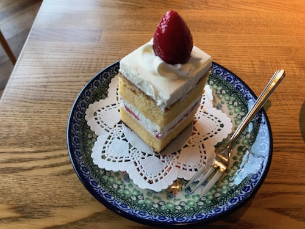
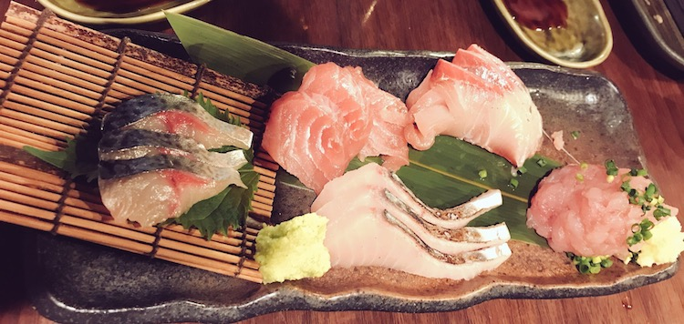

今日は11時に起きて歯と顔を片付けてバスで駅前に。
家のコーヒー豆が切れてたので、カフェでモーニングがてら豆を買う。
なんかママ友の会に連れてこられてたと思しき小学生くらいの子がタブレットで延々と大音量でバラエティ番組を見ていて、マトモに親に注意して貰えない子は可哀想だなと思ったりした。

ベーグルのBLTサンドとケーキを食べた。

これだけだとお腹が減ったのでケバブサンドも喰った。でぶ〜。
ところで来月二十日まで金がないのではなかったか。しかしこの喫茶店はカードで払え、五月払い分の日数は終わっているので、問題はない。ケバブの500円がかかるだけで済んだ。

都内へ。仲間内で遊んでいるパンデミックレガシーシーズン2をやりに。

これは疫病を押さえこむ「パンデミック」というボドゲがあって、それを「12ヶ月」分刻一刻とストーリーがうつろっていく形にして、やりきり型にした「パンデミックレガシー」があって、その続きである。

四人でやる。前作も滅法面白く、謎の難病を封じ込めるべく戦っていたら次第に思わぬストーリー展開になっていく感じで、何とか半年くらい掛けて世界を救った。
「まあまあやった」みたいな達成度のクリアだったのだけど楽しかったので続きが出たからやろう、という集まり。
シーズン2では1で救い切れず文明が崩壊した後から始まるのだが、1に負けず劣らず色々と面白い趣向があって、これまでの所かなり楽しんでやっている。今日で11月まで終わったので、次回は12月、いよいよ世界を救えるかどうか決まる筈だが……さて。

夕方までやったあとは居酒屋へ。ところでこちらは3円です。

本当はもっとするのだが、会員は1000円以内の刺身を2品まで、じゃんけんで勝てば1円、負けても99円で食えるという頭のおかしい5周年記念イベントをお店がやっていて、会員3人で行って、3回勝った。ボトルも負ければ10%、勝てば50%オフで勝ったのでけっこういい酒を半額で呑め、たらふく肴を喰い酒を呑むなどした。

## うたったうた ##
居酒屋店内でU2の With or Without You が流れていたので思わず唄い同行者に白い目で見られた。

<iframe width="560" height="315" src="https://www.youtube.com/embed/XmSdTa9kaiQ" frameborder="0" allow="autoplay; encrypted-media" allowfullscreen></iframe>

U2の "Joshua Tree" は名盤、特に "With or Without You" 含む序盤の3曲が神懸かっている。

あとはシャワーを浴びながらRCサクセション「いいことばかりはありゃしない」を、歌詞と曲調に反して上機嫌で唄った。
