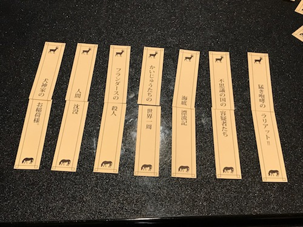
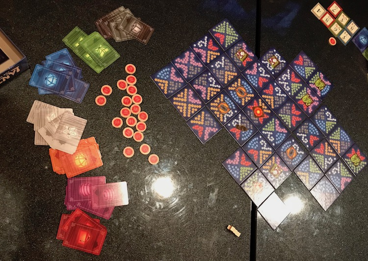

段階的に8時に起きていく作戦二日目。
今日は8:20にセットし、起きれたので、よしよし、と思い、12時まで二度寝た。

昼過ぎに都内へ。
今日はFGOのリアル脱出ゲームに行く予定で、まずはその前哨戦としてハワイ帰りの後輩を囲んでボドゲ会。
前日に貸し会議室を予約申請してみたが、なんか音沙汰がなかったので諦めて適当なカラオケの部屋を借りる。
今回のFGOのリアル脱出ゲームは「ベイカー街からの脱出」という副題が示唆するように、シャーロック・ホームズがクロースアップされている。
そこへ来て、カラオケであてがわれた部屋が221号室だったので一同大いにテンションが上がるなどした。
やったボドゲ：

* 『[死ぬまでにピラミッド][pyramid]』 by OinkGames

  

  ファラオが死ぬまでにより優れたピラミッドを作った人の勝ち、というゲーム。
  一部の材料を使うとファラオの寿命が縮み、最後のトドメを刺した人間は無条件で負け、というシビアなゲーム。
  材料はサイコロの出目で決まり、その中から選ばないといけないのだが、今回は物凄い出目が悪くて、3ターンで早々にファラオが死んでしまい、全員完成せずに終わってしまった……。

* 『横暴編集長』 by ジャンクション

  

  ベストセラーのタイトルを前後に分割した短冊を組み合わせて、新しい書名を作るゲーム。
  前々からやりたいと思っていた。
  各ターン、順に場に出ている短冊と手札の短冊を組み合わせて書名を作って、他の編集員の投票で選ばれた一冊が出版、という扱いになる。
  本来は二巡するのだが、今回は時間がなかったので一巡で終わり。
  これまでに出版されたタイトルの中から最優秀作を選出する。
  私の出したので一番ウケが良かったのは、「デカメロンの続編です」といって出した『デカオレンジ』。
  残念ながら僅差で選出ならず。以下が今回「出版」に至ったタイトルたち。

  

* 『テストプレイなんてしてないよ』 by Asmadi Games

  

  Twitterで話題になっていて買った爆笑ゲーム。
  完全にゲームバランスを考えずに足されたカードたちの条件を満たして勝ったり頓死したりする。
  「目的は勝利すること」「敗北すると勝利できない」などという人を喰ったような説明があるが、勝利条件・敗北条件はカードによって全然変わってくるのでこれ以上説明が出来ないというやつ。
  「〈わたし〉を意味する単語を喋ったら即負け」とか「100点貯めたら勝ち」とか本当に雑（褒め言葉）でたいへん馬鹿馬鹿しくて良い。

  何回か別の面子ではやっていたが、サークル関係では初。
  絶対に酒を入れた方が楽しいので、今度そういう会に持ってきてください！という要望を受けるなど。ぜひやろう。

* "Lanterns: The Harvest Festival" by Renegade Game Studios

  

  後輩がハワイで買ってきた、中国の燈籠祭を題材としたボードゲーム。
  色を揃えたり、チップを貯めたりして点数を手に入れていくというものだが、得点は他の人にも入る。
  ある程度邪魔しつつ自分の得点を上げていく戦略を練る、その制度設計が絶妙。
  色取り取りの燈籠が彩る盤面もフォトジェニックでよい。

  

  基本的には燈籠の色に対応するカードで役を作ると点が貰える。
  同色四枚、三色のペア、七色一枚ずつ、というのが役の一覧で、時と場合によって貰える点がかわる。
  ついいつもの癖で、「三色のペアっていうのは、赤のペア×2 + 青のペア×1 でもいいのかな？」「二色じゃん」「重複を込めて3色」「込めないで」というやり取りをしてしまった。
  数学者というのは "three *distinct* colors" と言われない限り重複も込めるのが当然だと思っていて、なるべく専門用語的な用法を日常に持ち込まないように気を付けようと思っていても、こういうルール解釈の時とかについつい出てしまう……。

その後、甘味を摂って脳をブーストし、遂にFGO脱出ゲームへ。

前日サークルの別面子が挑んで玉砕していたようだったので、俺達は脱出するぞ……！と意気込んでいたが、後一歩ならず。
謎の設計も「一歩手前までは気を付けていると出来るが完全正答は紙一重」という絶妙な難易度で、大変堪能しました。
ってかフルボイスで最高の映像を見れたしこれ満足しないひとはいないだろ……という感じ。難点を挙げるとすれば清姫ちゃんが出てないことくらいか。
最後の答え合わせで正答が発表される直前にあー！そういうことか！と気付き臍を噛むこと頻り。思わず叫んでしまった……。
正答率11%で今回は20組ちょい参加のところ、4組が正答に至っていた。その中の一組に思わぬ知り合いの顔を見付けびっくりするなどした。
いやほんと最高でしたね。またやりたい。
SCRAP主催のリアル脱出ゲームで最後まで完全脱出出来たことが1度もない（脱出は出来たけどトゥルーエンドではない、というのは1度だけあった）ので、本当に悔しい。ぐぬぬ。

その後はHUBで感想戦をして帰筑。深夜バスなので割高ですが、まあ楽しんだので何でもアリです。

[pyramid]: https://oinkgms.com/jp/pyramid

