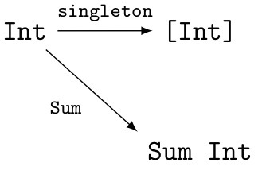

2012年頃から、Haskellコミュニティでは**自由モナド**というものが話題になって来ました。これを一言で説明してしまうと、`Functor`{.haskell} からモナドを作り出すための方法です。
自由モナドの使い方に関する日本語の説明は、既に優れたものが幾つかあります（たとえば[ふみさんの記事](http://fumieval.hatenablog.com/entry/20121111/1352614885)など）。

なので、本稿では、自由モナドの使い方ではなく、そもそも**自由モナドとは何なのか**、そもも**自由ってどういう意味？**という直観を、あまり数学に慣れ親しんでいない人に向けて説明してみようと思います。

その前に：文字列とリストの話
=======================
ところで、Haskellは文字列操作に強いってよく云われますよね。それは、Haskellでは素朴には文字列は文字の**有限リスト**として表現されていて、Haskellは[リストを操作する方法を沢山持っている](http://hackage.haskell.org/package/base-4.7.0.2/docs/Data-List.html)からでした[^2]。

もっとも、リストの操作は重いので、効率を重視する場合には `Text`{.haskell} や `ByteString`{.haskell} を使ったり、配列の場合は `Vector a`{.haskell} といった型を使うことになる訳です。

文字列やリストを作るのは、組込みの機能があるので簡単でした。では `Vector`{.haskell} や `Text`{.haskell} を作るのにはどうするか……というと、それぞれのライブラリが提供している函数を使って手で書いてもいいですが、`OverloadedStrings`{.haskell} や最近入った `OverloadedLists`{.haskell} 言語拡張を使えば、`"Hell-o, world!" :: Text`{.haskell} みたいにリテラルを使って構築することが出来ます。
こうしたリテラルのオーバーロードが違和感なく使えるのは、少なくとも列を作る操作に関しては、上で挙げたどの型も同じような性質を持つからです[^3]。

どういうことでしょう？まず、型 `a`{.haskell} からなる有限列を作ろうと思ったら、次の操作があれば十分なことがわかります：

* 一つの要素から成る列を作る操作 `singleton :: a → [a]`{.haskell} 
* 空の列 `[]`{.haskell}
* 連結 `(<>) :: [a] → [a] → [a]`{.haskell}

これらの操作は、上で挙げたどの型も持っているものです。更に、これらの操作はとても良く似た性質を持っています。

まず、空の列はどちらから連結しても、元のものと一致します。つまり、`[] <> xs == xs == xs <> []`{.haskell}が成り立ちます。また、三つの物を連結しようと思ったときに、左から順に連結しても、右から順に連結しても結果は同じです。つまり、`(xs <> ys) <> zs == xs <> (ys <> zs)`{.haskell}という関係が成り立っています。こうした性質はよく現れるので、名前がそれぞれ名前がついています：

* 単位律：`[] <> xs = xs = xs <> []`{.haskell}
  単位律を満たす元を単位元という。
* 結合律：`(xs <> ys) <> zs = xs <> (ys <> zs)`{.haskell}

一般に、こうした法則を満たす構造のことを**モノイド**と呼びます。Haskellではモノイドの構造を生かしたプログラムは日常的によく書かれていて、それを扱うための仕組みも[標準で提供されている](http://hackage.haskell.org/package/base-4.7.0.2/docs/Data-Monoid.html)ので、「知ってるよ」という人も多いでしょう。モノイドの型クラスの定義は次のようになっています：

```haskell
class Monoid m where
  mzero :: m
  mappend :: m -> m -> m

(<>) :: Monoid m => m -> m -> m
(<>) = mappend
```

空リスト `[]`{.haskell} に当るのが `mzero`{.haskell} で、リストの結合に当るのが `mappend`{.haskell} あるいはその中置演算子版 `(<>)`{.haskell}、という訳です。

たとえば、`Int`{.haskell} は足し算や掛け算についてモノイドになっています。たとえば、足し算については$(x + y) + z = x + (y + z)$とか$x + 0 = 0 + x = x$が成り立つ、といった具合です。掛け算と足し算それぞれ別々に構造を入れることが出来るので、それらを区別するために、Haskellの標準ライブラリでは、足し算のモノイドに対応する型を`Sum Int`{.haskell}、掛け算に対応するものを`Product Int`{.haskell}で表現しています：

```haskell
newtype Sum a = Sum { getSum :: a }
instance Num a => Monoid (Sum a) where
  mempty  = Sum 0
  Sum n <> Sum m = Sum (n + m)

mconcat :: Monoid m => [m] -> m
mconcat = foldr (<>) mempty
```

これを使えば、たとえば `Sum 12 <> Sum 30 == Sum 42`{.haskell} とか `mconcat [Sum 1, Sum 2, Sum 9, Sum 30] == Sum 42`{.haskell}のように、整数の足し算についてのモノイドに着目した操作をすることが出来るようになります。ちなみに、`mconcat`{.haskell} はリストの中のモノイドの要素を全部 `(<>)`{.haskell} で繋げる操作で、リストの `concat`{.haskell} に相当するような操作です。

見方を変えれば、`42 :: Int`{.haskell} という整数値を、`Sum :: Int → Sum Int`{.haskell}という函数によってモノイド`Sum Int`{.haskell}の中に埋め込んでいると見ることが出来ます。いってしまえば、これは上で見た `singleton`{.haskell} と同じような役割をしているわけです。矢印を使ってこの状況を模式的に描いてみるとこんな感じです：



ところで、先程の例に `mconcat [Sum 1, Sum 2, Sum 9, Sum 30] == Sum 42`{.haskell} というものがありましたが、これ、一々各要素に `Sum`{.haskell} を書くのが面倒なので `map`{.haskell} で書き直してみましょう：

```haskell
mconcat (map Sum [1,2,9,30]) == Sum 42
```

ここで、リストの内容を掛け合わせたくなったら、`Sum`{.haskell} を `Product`{.haskell} に変えれば良いでしょう：

```haskell
mconcat (map Product [1,2,9,30]) == Product 540
```

先程もいったように `Sum`{.haskell} や `Product`{.haskell} は `Int`{.haskell} を何らかのモノイドに埋め込むものだと思えます。すると、「リストの中の元を適当な元に埋め込んで、そいつらを全部 `(<>)`{.haskell} で繋げる」という操作を、次のように書くことが出来ます：

```haskell
liftMonoid :: Monoid m => (a -> m) -> [a] -> m
liftMonoid f = mconcat . map f
```

これを、上の図に倣って模式的に表せば、次のようになります：


面倒なので、以下`liftMonoid f`{.haskell}と書く代わりに$\tilde{f}$と書くことにしましょう。

特に、定義から $\tilde{f} (\mathop{\mathtt{singleton}} x) == \mathop{\tilde{f}} \mathtt{[x]}== \mathop{\mathtt{mconcat}} [f x] = f x$となります。関数合成で書けば、$\tilde{f} \circ \mathtt{singleton} = f$ ということです。これを上の図で見れば、$\alpha$からはじまって$\alpha \to [\alpha] \to m$と辿っても、$f$を使って直接$\alpha$から$m$に飛んでも結果は同じ、ということになります。このように、「矢印で描かれた図の中の、どの経路を通っても答えは同じ」というときに、この図式は**可換である**と云います。
なんだか小難しい言葉が出て来ましたが、この場合いっていることは $\tilde{f}$ は`f`{.haskell} の結果とちゃんと矛盾しない、ということだけです。

更に、よく考えるとこの $\tilde{f}$ は**モノイドとしての構造を保っている**ことがわかります。つまり、

* $\tilde{f}$によってリストの結合の単位元である空リストは`m`の単位元に移る：$\mathop{\tilde{f}} \mathord{[]} = \mathtt{mzero}$
* リストを結合してから $\tilde{f}$ しても、$\tilde{f}$したものをあとから `(<>)`{.haskell} でくっ付けても答えは同じ：$\tilde{f}(\mathtt{xs} \mathbin{<>} \mathtt{ys}) = \tilde{f}(\mathtt{xs}) \mathbin{<>} \tilde{f}(\mathtt{ys})$

が成り立っています。このように何らかの構造を保つ函数のことを、**準同型**と呼びます。つまり、$\tilde{f}$はモノイドの準同型になっているのです。

準同型になっているから、なんだっていうんだ？そんなの、数学オタクのマニアックな注記事項に過ぎないんじゃないの？？？

……そんなことはないです。これがどういう事なのか納得して貰えるために、この $\tilde{f}$ がどんなものなのかを考えてみましょう。

たとえば、$\tilde f$に、二要素から成るリストを入力してみましょう。コード中では `f'` と書くことにすると、：

```haskell
f' [x, y] == f' ([x] <> [y])
          == f' [x] <> f' [y]  -- 準同型だから
          == f x <> f y        -- 図式の可換性
```

同様に、三要素のリストを喰わせれば `f' [x,y,z] == f x <> f y <> f z`{.haskell} となります。$n$個の要素から成るリストを入力すれば、その $n$ 個を $m$ の演算で繋いだものが返ってくることがわかります。つまり、`[α]`はモノイドの計算式全体の集合になっていることがわかります。

$\alpha$ や $f, m$ をどのようにとっても、この性質を満たすような$\tilde{f}$は常に取ることが出来ます。更に、上の図式を可換にするような準同型は、 $\tilde{f}$ だけしかないこともわかります。

これらをまとめると

[^2]: 他に挙げられるHaskellの強みとして、無限リストを扱えるということが挙げられますが、とりあえず今回は有限リストだけ考えてみることにしましょう。

[^3]: もちろん、globパターンみたいなものを生成するのに文字列リテラルを使うこともありますが、今回はふつうの「列」と見做せる型のことだけを考えましょう。
